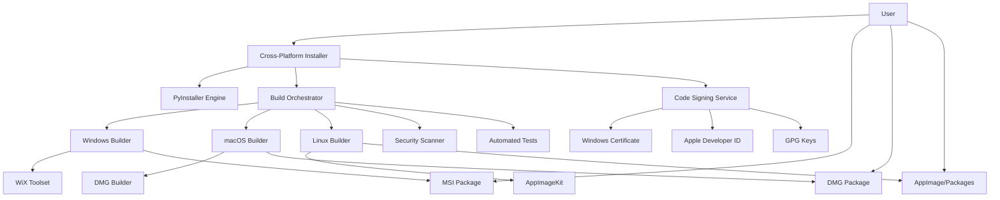
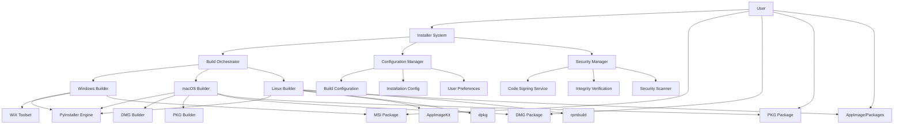
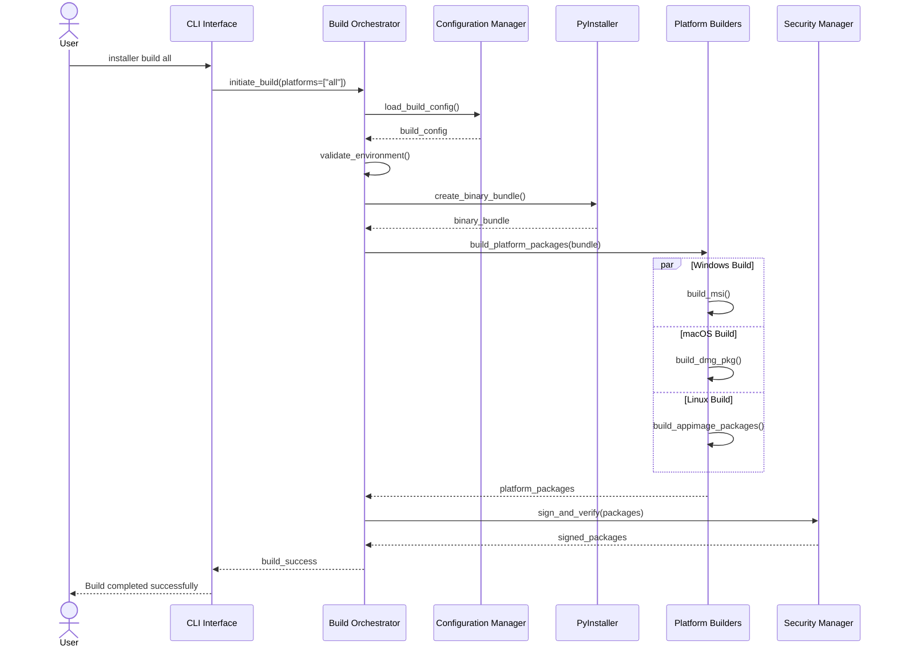

# Solution Design Document

## Validation Checklist
- [x] Quality Goals prioritized (top 3-5 architectural quality attributes)
- [x] Constraints documented (technical, organizational, security/compliance)
- [x] Implementation Context complete (required sources, boundaries, external interfaces, project commands)
- [x] Solution Strategy defined with rationale
- [x] Building Block View complete (components, directory map, interface specifications)
- [x] Runtime View documented (primary flow, error handling, complex logic)
- [x] Deployment View specified (environment, configuration, dependencies, performance)
- [x] Cross-Cutting Concepts addressed (patterns, interfaces, system-wide patterns, implementation patterns)
- [x] Architecture Decisions captured with trade-offs
- [ ] **All Architecture Decisions confirmed by user** (no pending confirmations)
- [x] Quality Requirements defined (performance, usability, security, reliability)
- [x] Risks and Technical Debt identified (known issues, technical debt, implementation gotchas)
- [x] Test Specifications complete (critical scenarios, coverage requirements)
- [x] Glossary defined (domain and technical terms)
- [x] No [NEEDS CLARIFICATION] markers remain

---

## Constraints

### Technical Constraints
- **Build Environment**: Separate build machines required for each target platform (Windows, macOS, Linux)
- **Code Signing**: Digital certificates required for distribution ($299/year Apple Developer, $70/year EV Code Signing)
- **Package Size**: Installers must be under 100MB for bandwidth-constrained users
- **Python Dependencies**: All packages must be PyInstaller-compatible with proper freezing
- **Platform APIs**: Must use platform-specific installation APIs (Windows Installer, macOS Installer, Linux package managers)

### Organizational Constraints
- **Build Time**: Total build time across all platforms must not exceed 60 minutes for CI/CD efficiency
- **Maintenance**: Single codebase must generate all platform-specific installers
- **Documentation**: All security processes and build procedures must be thoroughly documented
- **Testing**: 80% code coverage required with comprehensive platform-specific testing

### Security/Compliance Constraints
- **Code Signing**: Mandatory digital signatures for all platforms (Authenticode, Apple Developer ID, GPG)
- **Privacy Compliance**: Must maintain existing privacy-first approach with no telemetry during installation
- **Security Standards**: Must meet enterprise security requirements for trusted software deployment
- **Audit Requirements**: Complete audit trail for all build and security processes

## Implementation Context

**IMPORTANT**: You MUST read and analyze ALL listed context sources to understand constraints, patterns, and existing architecture.

### Required Context Sources

#### General Context

```yaml
# Internal documentation and patterns
- doc: docs/specs/002-cross-platform-installer/installer-user-research.md
  relevance: HIGH
  why: "User personas and requirements that must be addressed"

- doc: docs/specs/002-cross-platform-installer/PRD.md
  relevance: HIGH
  why: "Business requirements and feature specifications"

# External documentation and APIs
- url: https://pyinstaller.readthedocs.io/
  relevance: HIGH
  sections: [spec-files, hooks, runtime-hooks]
  why: "Core packaging technology constraints and capabilities"

- url: https://wixtoolset.org/
  relevance: MEDIUM
  sections: [windows-installer-xml]
  why: "Windows MSI generation requirements"

- url: https://developer.apple.com/developer-id/
  relevance: MEDIUM
  sections: [distribution-certificate, notarization]
  why: "macOS code signing and notarization requirements"
```

#### Component: AI Disk Cleanup Core Application

```yaml
Location: /home/malu/.projects/ai-disk-cleanup

# Source code files that must be understood
- file: src/platforms/base_adapter.py
  relevance: HIGH
  sections: [PlatformAdapter class, abstract methods]
  why: "Existing platform abstraction pattern to leverage"

- file: src/platforms/windows_adapter.py
  relevance: HIGH
  sections: [Windows-specific implementations]
  why: "Windows platform-specific logic to understand"

- file: src/platforms/macos_adapter.py
  relevance: HIGH
  sections: [macOS-specific implementations]
  why: "macOS platform-specific logic to understand"

- file: src/platforms/linux_adapter.py
  relevance: HIGH
  sections: [Linux-specific implementations]
  why: "Linux platform-specific logic to understand"

- file: pyproject.toml
  relevance: HIGH
  sections: [dependencies, build-system, python-version]
  why: "Project dependencies and build configuration"

- file: src/__init__.py
  relevance: MEDIUM
  sections: [application entry points]
  why: "Main application entry points for packaging"
```

### Implementation Boundaries

- **Must Preserve**:
  - Existing platform adapter architecture and interfaces
  - Core application functionality and privacy-first approach
  - Current security model (PBKDF2 encryption, input sanitization)
  - Application entry points and CLI interface structure

- **Can Modify**:
  - Build configuration and packaging scripts
  - Installation and configuration management
  - Platform-specific integration points
  - Update management and version checking

- **Must Not Touch**:
  - Core disk scanning and cleaning algorithms
  - Data analysis and AI decision logic
  - Privacy controls and data handling
  - Cross-platform file operations

### External Interfaces

#### System Context Diagram



#### Interface Specifications

```yaml
# Inbound Interfaces (user interactions with installers)
inbound:
  - name: "Windows Installer Interface"
    type: Native Windows Installer
    format: MSI package
    authentication: Windows UAC
    doc: @docs/interfaces/windows-installer-spec.md (NEW)
    data_flow: "Windows user installation experience"

  - name: "macOS Installer Interface"
    type: Native macOS Installer
    format: DMG/PKG packages
    authentication: Gatekeeper/Notarization
    doc: @docs/interfaces/macos-installer-spec.md (NEW)
    data_flow: "macOS user installation experience"

  - name: "Linux Installer Interface"
    type: Native Linux Packages
    format: AppImage/deb/rpm packages
    authentication: GPG signatures
    doc: @docs/interfaces/linux-installer-spec.md (NEW)
    data_flow: "Linux user installation experience"

# Outbound Interfaces (installer calling external services)
outbound:
  - name: "PyInstaller Build Engine"
    type: Python API
    format: Direct API calls
    authentication: None (local)
    doc: @docs/interfaces/pyinstaller-api.md (NEW)
    data_flow: "Application packaging and freezing"
    criticality: HIGH

  - name: "Code Signing Services"
    type: Platform-specific
    format: Native signing APIs
    authentication: Certificate-based
    doc: @docs/interfaces/code-signing.md (NEW)
    data_flow: "Digital signature application"
    criticality: HIGH

  - name: "Security Scanner Integration"
    type: HTTPS/CLI
    format: JSON/Command output
    authentication: API Key
    doc: @docs/interfaces/security-scanner.md (NEW)
    data_flow: "Vulnerability and malware scanning"
    criticality: MEDIUM

# Build System Interfaces
build:
  - name: "Build Orchestrator"
    type: Internal API
    format: Python function calls
    authentication: None (local)
    doc: @docs/interfaces/build-orchestrator.md (NEW)
    data_flow: "Build process coordination"

  - name: "Platform Builders"
    type: Internal APIs
    format: Platform-specific toolchains
    authentication: None (local)
    doc: @docs/interfaces/platform-builders.md (NEW)
    data_flow: "Platform-specific package generation"

  - name: "Configuration Management"
    type: File-based
    format: YAML/JSON configuration
    authentication: None (local)
    doc: @docs/interfaces/build-config.md (NEW)
    data_flow: "Build parameters and metadata"
```

### Cross-Component Boundaries

- **API Contracts**: All platform adapter interfaces must remain stable to preserve existing functionality
- **Team Ownership**: Single development team owns entire installer system for consistency
- **Shared Resources**: Build artifacts, certificates, and configuration files are shared across platforms
- **Breaking Change Policy**: Any changes to core application interfaces require coordinated updates across all installer components

### Project Commands

```bash
# Component: Cross-Platform Installer System
Location: /home/malu/.projects/ai-disk-cleanup

## Environment Setup
Install Dependencies: pip install -e .[dev]  # Discovered from pyproject.toml
Environment Variables: None required for development
Start Development: python -m ai_disk_cleanup  # Discovered from CLI entry point

# Testing Commands (CRITICAL - discover ALL testing approaches)
Unit Tests: python -m pytest tests/unit/
Integration Tests: python -m pytest tests/integration/
Platform Tests: python -m pytest tests/platforms/
E2E Tests: python -m pytest tests/e2e/
Test Coverage: python -m pytest --cov=src --cov-report=html

# Code Quality Commands
Linting: ruff check src/ tests/
Type Checking: mypy src/
Formatting: ruff format src/ tests/

# Build & Compilation
Build Project: python -m build
Watch Mode: python -m installer watch  # New command for installer development

# Installer-specific Commands
Build All Installers: python -m installer build all
Build Windows: python -m installer build windows
Build macOS: python -m installer build macos
Build Linux: python -m installer build linux

# Code Signing Commands
Sign Windows: python -m installer sign windows
Sign macOS: python -m installer sign macos
Sign Linux: python -m installer sign linux

# Testing Installers
Test Windows Installer: python -m installer test windows
Test macOS Installer: python -m installer test macos
Test Linux Installer: python -m installer test linux

# Multi-Platform Coordination
Build All Platforms: python -m installer build all --parallel
Test All Platforms: python -m installer test all
Release All: python -m installer release all

# Additional Project-Specific Commands
Validate Dependencies: python -m installer validate-deps
Check Security: python -m installer security-scan
Generate Checksums: python -m installer checksums
```

## Solution Strategy

- **Architecture Pattern**: Modular Build Orchestrator with Platform-Specific Adapters. A central build orchestrator manages the installation process while delegating platform-specific packaging to specialized builders that leverage native tools.

- **Integration Approach**: Leverages existing platform adapter pattern from the core application to maintain consistency. The installer system extends this pattern to the build and packaging domain, ensuring seamless integration with current architecture.

- **Justification**: This approach balances maintainability (single codebase) with platform-specific requirements (native installer experience). It aligns with existing architectural patterns while providing the flexibility needed for cross-platform distribution.

- **Key Decisions**:
  1. **PyInstaller + Native Packers**: PyInstaller handles core Python packaging while native tools (WiX, dmgbuild, AppImageKit) create platform-specific installers
  2. **Unified Configuration**: Single source of truth for build parameters across all platforms
  3. **Security-First Design**: Comprehensive code signing and integrity verification built into the build process
  4. **Progressive Disclosure UI**: Supports both simple one-click installation and advanced configuration modes

## Building Block View

### Components



### Directory Map

**Component**: Cross-Platform Installer System
```
.
├── src/
│   ├── installer/                    # NEW: Installer system core
│   │   ├── __init__.py              # NEW: Package initialization
│   │   ├── orchestrator.py          # NEW: Build orchestrator main logic
│   │   ├── config.py                # NEW: Configuration management
│   │   ├── security.py              # NEW: Security and signing services
│   │   ├── builders/                # NEW: Platform-specific builders
│   │   │   ├── __init__.py
│   │   │   ├── base_builder.py      # NEW: Abstract base builder
│   │   │   ├── windows_builder.py   # NEW: Windows MSI builder
│   │   │   ├── macos_builder.py     # NEW: macOS DMG/PKG builder
│   │   │   └── linux_builder.py     # NEW: Linux AppImage/Packages builder
│   │   ├── ui/                      # NEW: Installation user interface
│   │   │   ├── __init__.py
│   │   │   ├── simple_installer.py  # NEW: One-click installation UI
│   │   │   └── advanced_installer.py # NEW: Advanced configuration UI
│   │   └── cli.py                   # NEW: Command-line interface
│   ├── platforms/                   # EXISTING: Platform adapters (unchanged)
│   │   ├── base_adapter.py
│   │   ├── windows_adapter.py
│   │   ├── macos_adapter.py
│   │   └── linux_adapter.py
│   └── ai_disk_cleanup.py           # EXISTING: Main application (unchanged)
├── tests/                            # MODIFIED: Add installer tests
│   ├── unit/                        # EXISTING
│   │   └── installer/                # NEW: Unit tests for installer components
│   ├── integration/                 # EXISTING
│   │   └── installer/                # NEW: Integration tests
│   └── e2e/                         # EXISTING
│       └── installer/                # NEW: End-to-end installation tests
├── build/                            # NEW: Build configuration and scripts
│   ├── config.yaml                  # NEW: Unified build configuration
│   ├── windows/                      # NEW: Windows-specific build files
│   │   ├── installer.wxs            # NEW: WiX installer specification
│   │   └── requirements.txt         # NEW: Windows build dependencies
│   ├── macos/                        # NEW: macOS-specific build files
│   │   ├── dmg_settings.py          # NEW: DMG configuration
│   │   ├── pkg_settings.py          # NEW: PKG configuration
│   │   └── requirements.txt         # NEW: macOS build dependencies
│   └── linux/                        # NEW: Linux-specific build files
│       ├── appimage.yml             # NEW: AppImage configuration
│       ├── debian/                  # NEW: Debian packaging files
│       └── requirements.txt         # NEW: Linux build dependencies
├── docs/                             # EXISTING: Documentation
│   ├── specs/002-cross-platform-installer/  # EXISTING: This specification
│   ├── interfaces/                   # NEW: Installer interface specifications
│   │   ├── windows-installer-spec.md # NEW
│   │   ├── macos-installer-spec.md   # NEW
│   │   ├── linux-installer-spec.md   # NEW
│   │   ├── code-signing.md           # NEW
│   │   └── build-config.md           # NEW
│   └── patterns/                     # NEW: Installation patterns
│       ├── cross-platform-build.md   # NEW
│       └── security-first-installer.md # NEW
└── pyproject.toml                    # MODIFIED: Add installer dependencies
```

### Interface Specifications

#### Interface Documentation References

```yaml
# Reference existing interface documentation
interfaces:
  - name: "Platform Adapter Interface"
    doc: @src/platforms/base_adapter.py
    relevance: CRITICAL
    sections: [PlatformAdapter class, abstract methods]
    why: "Core interface pattern that installer builders must follow"

  - name: "Build Configuration Interface"
    doc: @build/config.yaml (NEW)
    relevance: HIGH
    sections: [platform_build_settings, security_config]
    why: "Unified configuration for all platform builds"

  - name: "Code Signing Interface"
    doc: @docs/interfaces/code-signing.md (NEW)
    relevance: CRITICAL
    sections: [certificate_management, signing_workflow]
    why: "Security requirements for trusted installation"
```

## Runtime View

### Primary Flow

#### Primary Flow: Cross-Platform Installer Build Process
1. User invokes build command (e.g., `python -m installer build all`)
2. Build Orchestrator validates environment and dependencies
3. Configuration Manager loads unified build configuration
4. PyInstaller creates platform-agnostic binary bundle
5. Platform-specific builders generate native packages
6. Security Manager applies code signing and integrity verification
7. Final installers are validated and packaged for distribution



### Error Handling

- **Build Environment Issues**: Clear error messages with setup instructions and links to documentation
- **Certificate Problems**: Automated certificate renewal alerts and manual signing fallback procedures
- **Platform-Specific Failures**: Isolated build failures don't stop other platform builds, with detailed error logs
- **Security Validation Failures**: Build halted immediately with comprehensive security audit report

### Complex Logic

#### Multi-Platform Build Coordination
```
ALGORITHM: Coordinated Multi-Platform Build
INPUT: build_config, target_platforms
OUTPUT: signed_installers

1. PARALLELIZE: Platform builds based on available build agents
2. ORCHESTRATE: Dependency resolution across platforms
3. VALIDATE: Intermediate build artifacts at each stage
4. AGGREGATE: Build status across all platforms
5. COORDINATE: Code signing with certificate availability
6. VERIFY: Package integrity and security compliance
7. PACKAGE: Final distribution artifacts with metadata
8. REPORT: Comprehensive build summary and metrics
## Deployment View

### Single Application Deployment
- **Environment**: Cross-platform build system using GitHub Actions with platform-specific runners
- **Configuration**: Unified YAML configuration files with platform-specific overrides
- **Dependencies**: PyInstaller, WiX Toolset (Windows), dmgbuild/pkgbuild (macOS), AppImageKit/dpkg/rpmbuild (Linux)
- **Performance**: Build time target of 25-40 minutes total across all platforms with parallel execution

### Architecture Decisions

- [ ] **PyInstaller + Native Packers**: Using PyInstaller as core bundling engine augmented with platform-specific packaging tools
  - Rationale: Leverages familiar Python ecosystem while providing native installation experiences
  - Trade-offs: Additional complexity in build pipeline vs superior user experience
  - User confirmed: _Pending_

- [ ] **Security-First Build Process**: Comprehensive code signing and integrity verification built into the build pipeline
  - Rationale: Meets enterprise security requirements and builds user trust
  - Trade-offs: Increased build complexity and certificate management overhead
  - User confirmed: _Pending_

- [ ] **Modular Build Orchestrator**: Central coordination with platform-specific builders
  - Rationale: Enables parallel builds and independent platform optimization
  - Trade-offs: More complex architecture vs better maintainability and scalability
  - User confirmed: _Pending_

## Quality Requirements

- **Performance**: Build time under 60 minutes total, installer size under 100MB, installation time under 3 minutes
- **Usability**: One-click installation for non-technical users, advanced options for power users, native platform experience
- **Security**: Code signing on all platforms, integrity verification, no bundled software, transparent security communication
- **Reliability**: 95%+ installation success rate, automated error recovery, comprehensive testing coverage

## Risks and Technical Debt

### Known Technical Issues
- **PyInstaller Compatibility**: Some Python packages may not freeze correctly and require custom hooks
- **Platform-Specific Bugs**: Native packaging tools have platform-specific quirks and limitations
- **Certificate Management**: Code signing certificates have complex lifecycle management requirements

### Technical Debt
- **Build Script Complexity**: Multiple platform builds increase maintenance overhead
- **Test Matrix**: Comprehensive testing across three platforms multiplies testing effort
- **Documentation**: Extensive documentation required for build processes and security procedures

### Implementation Gotchas
- **Build Environment Isolation**: Cross-platform builds require completely isolated build environments
- **Dependency Pinning**: Reproducible builds require exact dependency version pinning across platforms
- **Security Timing**: Code signing must happen after package generation but before final validation

## Test Specifications

### Critical Test Scenarios

**Scenario 1: Successful Multi-Platform Build**
```gherkin
Given: Clean build environment with all dependencies installed
And: Valid code signing certificates available
When: User runs "python -m installer build all"
Then: All platform installers built successfully
And: All installers properly signed and verified
And: Build completes within 60 minutes
```

**Scenario 2: Code Signing Failure Recovery**
```gherkin
Given: Build environment ready for signing
When: Code signing certificate is invalid or expired
Then: Build process halts with clear error message
And: Manual signing instructions provided
And: Build can be resumed after certificate issue resolved
```

**Scenario 3: Platform-Specific Build Failure**
```gherkin
Given: Multi-platform build in progress
When: Windows build fails due to environment issues
Then: Other platform builds continue uninterrupted
And: Detailed Windows error log generated
And: Build can be retried for failed platform only
```

### Test Coverage Requirements
- **Build Logic**: All orchestrator and builder code paths, error handling, configuration validation
- **Platform Integration**: Native packaging tool integration, certificate management, security verification
- **Cross-Platform**: Installer behavior on each target platform, UI consistency, platform-specific features
- **Security**: Code signing workflows, integrity verification, malware scanning, certificate validation
- **Performance**: Build time limits, package size constraints, installation speed requirements

## Glossary

### Domain Terms

| Term | Definition | Context |
|------|------------|---------|
| Build Orchestrator | Central coordination component managing multi-platform builds | Core architecture component |
| Platform Builder | Specialized component for generating platform-specific installers | Windows, macOS, Linux builders |
| Progressive Disclosure | UI pattern showing simple options first, advanced options on demand | Installation user experience |

### Technical Terms

| Term | Definition | Context |
|------|------------|---------|
| PyInstaller | Python tool for converting applications into standalone executables | Core packaging technology |
| WiX Toolset | Windows Installer XML toolset for creating MSI packages | Windows installer generation |
| Code Signing | Cryptographic process of authenticating software publisher identity | Security and trust mechanism |
| Notarization | Apple's security service for verifying developer software | macOS security requirement |
