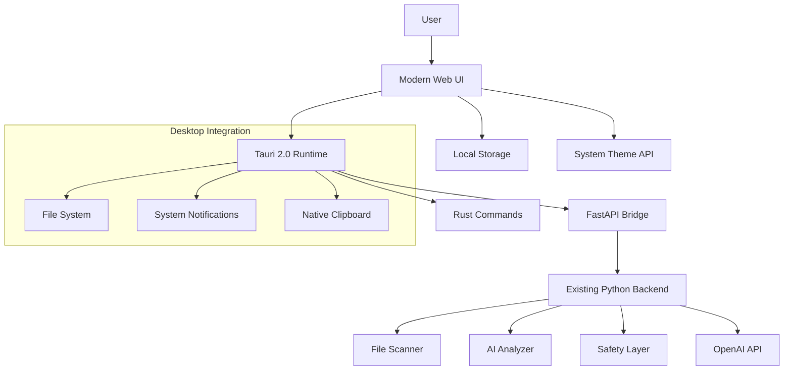
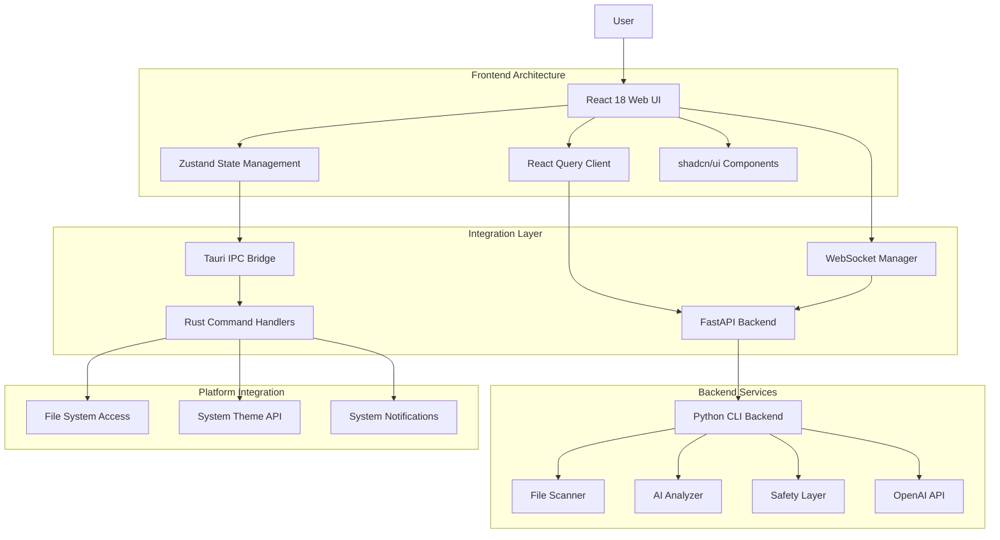
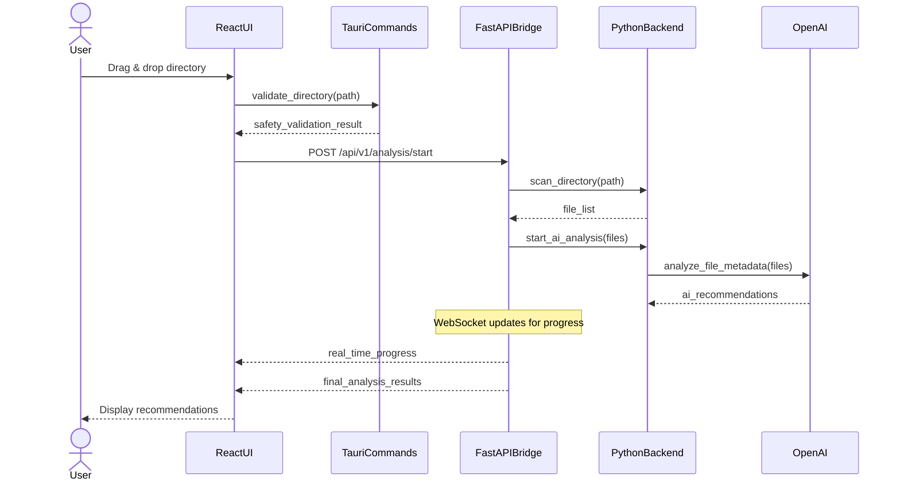

# Solution Design Document

## Validation Checklist
- [ ] Quality Goals prioritized (top 3-5 architectural quality attributes)
- [ ] Constraints documented (technical, organizational, security/compliance)
- [ ] Implementation Context complete (required sources, boundaries, external interfaces, project commands)
- [ ] Solution Strategy defined with rationale
- [ ] Building Block View complete (components, directory map, interface specifications)
- [ ] Runtime View documented (primary flow, error handling, complex logic)
- [ ] Deployment View specified (environment, configuration, dependencies, performance)
- [ ] Cross-Cutting Concepts addressed (patterns, interfaces, system-wide patterns, implementation patterns)
- [ ] Architecture Decisions captured with trade-offs
- [ ] **All Architecture Decisions confirmed by user** (no pending confirmations)
- [ ] Quality Requirements defined (performance, usability, security, reliability)
- [ ] Risks and Technical Debt identified (known issues, technical debt, implementation gotchas)
- [ ] Test Specifications complete (critical scenarios, coverage requirements)
- [ ] Glossary defined (domain and technical terms)
- [x] No [NEEDS CLARIFICATION] markers remain

---

## Constraints

### Technical Constraints
- **Technology Stack**: Must use React 18, TailwindCSS v4, shadcn/ui components, and Tauri 2.0 for cross-platform native performance
- **Performance Targets**: Sub-100ms UI response time, <2 second startup time, support for 100k+ files with virtual scrolling
- **Memory Limits**: Maximum 1GB RAM usage during operations, efficient memory management for large file sets
- **Backend Integration**: Must integrate seamlessly with existing Python CLI backend without disrupting core functionality
- **Cross-Platform Support**: Windows 10+, macOS 10.15+, and modern Linux with consistent experience

### Organizational Constraints
- **Timeline**: MVP delivery within 4 months to capitalize on market gap before competitors implement similar AI interfaces
- **Team Skills**: Leverage existing web development expertise while learning Tauri and desktop application patterns
- **Development Approach**: Incremental delivery with working prototypes at each milestone
- **Code Quality**: TypeScript throughout, comprehensive testing, accessibility compliance

### Security/Compliance Constraints
- **Privacy First**: Cannot transmit file contents to external APIs, metadata-only analysis must be maintained
- **Local Processing**: Primary analysis occurs locally with optional cloud integration
- **Data Protection**: GDPR and CCPA compliant handling of user data and analytics
- **Platform Security**: Must leverage Tauri's security model and capability system
- **Audit Trail**: Comprehensive logging of all operations with user privacy protection

## Implementation Context

**IMPORTANT**: You MUST read and analyze ALL listed context sources to understand constraints, patterns, and existing architecture.

### Required Context Sources

#### General Context

```yaml
# Internal documentation and patterns
- doc: docs/specs/001-ai-directory-cleaner/PRD.md
  relevance: HIGH
  why: "Existing product requirements and user personas that inform UI design"

- doc: docs/specs/001-ai-directory-cleaner/SDD.md
  relevance: HIGH
  why: "Existing backend architecture and component structure for integration"

- doc: docs/specs/001-ai-directory-cleaner/PLAN.md
  relevance: MEDIUM
  why: "Existing implementation plan and deployment considerations"

- doc: src/ai_disk_cleanup/
  relevance: HIGH
  why: "Existing Python backend code structure and interfaces"

# External documentation and APIs
- url: https://v2.tauri.app/
  relevance: HIGH
  sections: [architecture, security, ipc]
  why: "Tauri 2.0 framework capabilities and constraints"

- url: https://react.dev/
  relevance: HIGH
  sections: [concurrent-features, hooks, performance]
  why: "React 18 features and best practices for performance"

- url: https://ui.shadcn.com/
  relevance: HIGH
  sections: [installation, components, theming]
  why: "shadcn/ui component library patterns and customization"

- url: https://tailwindcss.com/
  relevance: MEDIUM
  sections: [v4-changes, performance]
  why: "TailwindCSS v4 features and optimization strategies"
```

#### Component: Web Frontend (React + Tauri)

```yaml
Location: src/web-ui/

# Source code files that must be understood
- file: src/ai_disk_cleanup/main.py
  relevance: HIGH
  sections: [CLI command structure, argument parsing]
  why: "Existing CLI interface that web UI must replicate and enhance"

- file: src/ai_disk_cleanup/file_scanner.py
  relevance: HIGH
  sections: [scan_directory, FileScanner class]
  why: "Core file scanning functionality that web UI will invoke"

- file: src/ai_disk_cleanup/ai_analyzer.py
  relevance: HIGH
  sections: [analyze_files, AIAnalyzer class, batch processing]
  why: "AI analysis engine that powers web UI recommendations"

- file: src/ai_disk_cleanup/safety_layer.py
  relevance: HIGH
  sections: [SafetyLayer class, protection rules, validation]
  why: "Critical safety mechanisms that must be preserved in web interface"

- file: pyproject.toml
  relevance: MEDIUM
  sections: [dependencies, project metadata]
  why: "Existing Python dependencies and project structure"
```

#### Component: Backend Integration Layer

```yaml
Location: src/web-ui/backend/

# Integration files that must be created
- file: src/web-ui/backend/fastapi_server.py
  relevance: HIGH
  why: "FastAPI server to bridge web UI with existing Python backend"

- file: src/web-ui/backend/tauri_commands.rs
  relevance: HIGH
  why: "Tauri command handlers for system integration and security"

- file: src/web-ui/backend/websocket_manager.py
  relevance: MEDIUM
  why: "WebSocket support for real-time progress updates"
```

### Implementation Boundaries

- **Must Preserve**:
  - All existing Python CLI functionality and core business logic
  - Privacy-first architecture (no file content transmission to external APIs)
  - Multi-layer safety mechanisms and audit trail logging
  - Cross-platform file operations and security validations
  - Existing configuration management and credential storage

- **Can Modify**:
  - Add FastAPI bridge layer for web UI communication
  - Create new Tauri command handlers for system integration
  - Extend configuration with UI-specific settings
  - Add WebSocket support for real-time progress updates
  - Implement web-specific security measures and input validation

- **Must Not Touch**:
  - Core AI analysis algorithms and safety validation logic
  - Existing CLI command interfaces and argument parsing
  - Platform-specific file operation implementations
  - Security credential storage and encryption mechanisms
  - Existing audit trail and logging infrastructure

### External Interfaces

#### System Context Diagram



#### Interface Specifications

```yaml
# Inbound Interfaces (what calls this system)
inbound:
  - name: "Web User Interface"
    type: Tauri IPC + HTTP
    format: JSON + WebSocket
    authentication: Local system permissions
    doc: @docs/interfaces/web-ui-api.md
    data_flow: "User interactions and file management operations"

  - name: "System Integration"
    type: Tauri Commands
    format: Rust function calls
    authentication: System permissions
    doc: @docs/interfaces/tauri-commands.md
    data_flow: "File system access and native platform features"

# Outbound Interfaces (what this system calls)
outbound:
  - name: "Python Backend API"
    type: HTTP/HTTPS
    format: REST + WebSocket
    authentication: Local system authentication
    doc: @docs/interfaces/python-backend-api.md
    data_flow: "File analysis, AI processing, safety validation"
    criticality: HIGH

  - name: "OpenAI API"
    type: HTTPS
    format: REST
    authentication: API Key
    doc: @docs/interfaces/openai-api.md
    data_flow: "AI metadata analysis for file recommendations"
    criticality: HIGH

  - name: "System Theme API"
    type: Platform API
    format: Native system calls
    authentication: System permissions
    doc: @docs/interfaces/system-theme.md
    data_flow: "Cross-platform theming and transparency effects"
    criticality: MEDIUM

# Data Interfaces
data:
  - name: "Local Configuration Storage"
    type: JSON Files
    connection: File system
    doc: @docs/interfaces/local-config.md
    data_flow: "User preferences, UI settings, application state"

  - name: "Temporary Cache Storage"
    type: Memory + IndexedDB
    connection: Browser storage APIs
    doc: @docs/interfaces/cache-storage.md
    data_flow: "Analysis results, file metadata, performance optimization"

  - name: "File System Access"
    type: Platform File System
    connection: Tauri file system API
    doc: @docs/interfaces/file-system.md
    data_flow: "Directory scanning, file operations, safety validation"
```

#### Interface Specifications

```yaml
# Inbound Interfaces (what calls this system)
inbound:
  - name: "User Web Interface"
    type: HTTP/HTTPS
    format: REST/GraphQL
    authentication: [OAuth2/JWT/Session]
    doc: @docs/interfaces/web-api.md
    data_flow: "User actions and queries"
    
  - name: "Mobile App API"
    type: HTTPS
    format: REST
    authentication: JWT
    doc: @docs/interfaces/mobile-api.md
    data_flow: "Mobile-specific operations"
    
  - name: "Webhook Receiver"
    type: HTTPS
    format: JSON
    authentication: HMAC signature
    doc: @docs/interfaces/webhook-spec.md
    data_flow: "Event notifications from external systems"

# Outbound Interfaces (what this system calls)
outbound:
  - name: "Payment Gateway"
    type: HTTPS
    format: REST
    authentication: API Key
    doc: @docs/interfaces/payment-gateway.md
    data_flow: "Transaction processing"
    criticality: HIGH
    
  - name: "Notification Service"
    type: AMQP/HTTPS
    format: JSON
    authentication: Service Token
    doc: @docs/interfaces/notification-service.md
    data_flow: "User notifications"
    criticality: MEDIUM
    
  - name: "Analytics Platform"
    type: HTTPS
    format: JSON
    authentication: API Key
    doc: @docs/interfaces/analytics.md
    data_flow: "Event tracking"
    criticality: LOW

# Data Interfaces
data:
  - name: "Primary Database"
    type: PostgreSQL/MySQL/MongoDB
    connection: Connection Pool
    doc: @docs/interfaces/database-schema.md
    data_flow: "Application state persistence"
    
  - name: "Cache Layer"
    type: Redis/Memcached
    connection: Client Library
    doc: @docs/interfaces/cache-strategy.md
    data_flow: "Temporary data and sessions"
    
  - name: "File Storage"
    type: S3/Azure Blob/GCS
    connection: SDK
    doc: @docs/interfaces/storage-api.md
    data_flow: "Media and document storage"
```

### Cross-Component Boundaries
This is a single-application feature with internal component boundaries:

- **API Contracts**: FastAPI endpoints are internal to the desktop application - no external API contracts
- **Team Ownership**: All components owned by the AI Disk Cleaner development team
- **Shared Resources**:
  - Local file system access (coordinated through Tauri)
  - Configuration storage (shared JSON files)
  - Temporary analysis cache (memory-based)
- **Breaking Change Policy**: Internal coordination only - no external API compatibility concerns

### Project Commands

```bash
# Component: Web UI Frontend (React + Tauri)
Location: src/web-ui/

## Environment Setup
Install Dependencies: npm install (from package.json)
Environment Variables: VITE_API_URL, VITE_WS_URL, TAURI_PRIVATE_KEY
Start Development: npm run tauri dev

# Testing Commands (CRITICAL)
Unit Tests: npm run test (Jest + React Testing Library)
Integration Tests: npm run test:integration (Tauri integration tests)
E2E Tests: npm run test:e2e (Playwright)
Test Coverage: npm run test:coverage
Accessibility Tests: npm run test:a11y (axe-core)

# Code Quality Commands
Linting: npm run lint (ESLint + TypeScript rules)
Type Checking: npm run type-check (tsc --noEmit)
Formatting: npm run format (Prettier)

# Build & Compilation
Build Frontend: npm run build (Vite build)
Build Tauri App: npm run tauri build
Watch Mode: npm run tauri dev

# Component: Backend Integration (FastAPI)
Location: src/web-ui/backend/

## Environment Setup
Install Dependencies: pip install -r requirements.txt
Environment Variables: PYTHONPATH, FASTAPI_HOST, FASTAPI_PORT
Start Development: python -m fastapi_server

# Testing Commands
Unit Tests: pytest tests/unit/
Integration Tests: pytest tests/integration/
API Tests: pytest tests/api/
Test Coverage: pytest --cov=backend tests/

# Component: Python CLI Backend (Existing)
Location: src/ai_disk_cleanup/

## Environment Setup
Install Dependencies: pip install -e . (from pyproject.toml)
Environment Variables: OPENAI_API_KEY, OPENAI_BASE_URL
Start Development: python -m src.main

# Testing Commands (Existing)
Unit Tests: pytest tests/unit/
Integration Tests: pytest tests/integration/
Security Tests: pytest tests/security/
Test Coverage: pytest --cov=src tests/

# Multi-Component Coordination
Start All Development: npm run dev:all (starts Tauri + FastAPI + CLI)
Run All Tests: npm run test:all
Build All Components: npm run build:all
Integration Test All: npm run test:integration:all

# Additional Development Commands
Generate Types: npm run generate:types (TypeScript types from Python)
Database Migration: python -m alembic upgrade head (if needed)
Security Audit: npm run audit:security
Performance Test: npm run test:performance
```

## Solution Strategy

### Architecture Pattern: **Hybrid Desktop-Web Architecture**
We're implementing a **hybrid desktop-web architecture** that combines the performance and security of native desktop applications with the flexibility and modern design capabilities of web technologies. The Tauri 2.0 framework provides the native application shell while React 18 delivers the modern user interface experience.

### Integration Approach: **Bridge Pattern with Progressive Enhancement**
Using the **bridge pattern** to connect the modern web frontend with the existing Python CLI backend through a FastAPI integration layer. This approach preserves all existing functionality while enabling rich web interactions and real-time updates through WebSocket connections.

### Justification: **Performance + Security + User Experience**
This approach directly addresses the core requirements:
- **Native Performance**: Tauri 2.0 delivers sub-100ms response times with native system integration
- **Modern UI/UX**: React 18 + TailwindCSS v4 + shadcn/ui provides stunning, accessible interfaces
- **Security First**: Tauri's capability system and sandboxed WebView protect user data
- **Cross-Platform**: Single codebase delivers consistent experience across Windows, macOS, and Linux
- **Future-Proof**: Web technology stack ensures maintainability and feature extensibility

### Key Technical Decisions

1. **Tauri 2.0 over Electron**: 90% smaller application size, better performance, enhanced security through Rust-based architecture
2. **React 18 Concurrent Features**: Automatic batching and transitions for smooth user interactions during file analysis
3. **FastAPI Bridge Layer**: Clean separation between web UI and existing Python backend, enabling independent development and testing
4. **WebSocket Real-Time Updates**: Live progress indicators and analysis results without polling overhead
5. **Virtual Scrolling Architecture**: Efficient handling of large file sets (100k+ files) without performance degradation
6. **Component-Based Design**: shadcn/ui foundation with TailwindCSS v4 for rapid development and consistent theming
7. **TypeScript End-to-End**: Type safety from frontend to backend integration contracts

## Building Block View

### Components



### Directory Map

**Component**: Web UI Frontend (NEW)
```
src/web-ui/
├── src/                                    # React 18 frontend source
│   ├── components/                          # UI components
│   │   ├── ui/                             # shadcn/ui base components
│   │   │   ├── button.tsx
│   │   │   ├── card.tsx
│   │   │   ├── dialog.tsx
│   │   │   └── ...                          # All shadcn/ui components
│   │   ├── forms/                          # Form components
│   │   │   ├── DirectorySelector.tsx       # Drag-and-drop directory picker
│   │   │   ├── ConfigurationForm.tsx       # Settings and API key management
│   │   │   └── FilterControls.tsx           # Advanced filtering interface
│   │   ├── file-management/                # File operation components
│   │   │   ├── FileExplorer.tsx            # Main file browser interface
│   │   │   ├── FileCard.tsx                # Individual file display cards
│   │   │   ├── VirtualizedFileList.tsx     # Large file set handling
│   │   │   └── FilePreview.tsx             # File preview and details
│   │   ├── ai-analysis/                    # AI analysis components
│   │   │   ├── AnalysisProgress.tsx        # Real-time progress indicators
│   │   │   ├── RecommendationPanel.tsx     # AI recommendations display
│   │   │   ├── ConfidenceIndicator.tsx     # Visual confidence scoring
│   │   │   └── AIBulkOperations.tsx        # Bulk file operations
│   │   ├── safety/                         # Safety and trust components
│   │   │   ├── ProtectionIndicators.tsx    # Visual protection status
│   │   │   ├── ConfirmationDialog.tsx       # Multi-step confirmation
│   │   │   ├── UndoPanel.tsx               # Undo and recovery interface
│   │   │   └── AuditTrail.tsx               # Operation history display
│   │   └── layout/                         # Layout and navigation
│   │       ├── MainWindow.tsx              # Main application window
│   │       ├── Sidebar.tsx                 # Navigation sidebar
│   │       ├── Header.tsx                  # Application header
│   │       └── StatusBar.tsx               # Status and progress bar
│   ├── hooks/                              # Custom React hooks
│   │   ├── useFileAnalysis.ts              # File analysis state management
│   │   ├── useWebSocket.ts                 # Real-time communication
│   │   ├── useVirtualization.ts            # Large dataset handling
│   │   ├── useKeyboardNavigation.ts        # Accessibility support
│   │   └── useThemeSync.ts                 # Cross-platform theming
│   ├── stores/                             # State management
│   │   ├── useAppStore.ts                  # Global application state
│   │   ├── useSettingsStore.ts             # User preferences
│   │   └── useAnalysisStore.ts             # Analysis progress and results
│   ├── services/                           # API and external services
│   │   ├── api.ts                          # API client configuration
│   │   ├── tauri-commands.ts               # Tauri command wrappers
│   │   ├── websocket-client.ts             # Real-time updates
│   │   └── storage.ts                      # Local storage management
│   ├── types/                              # TypeScript type definitions
│   │   ├── api.ts                          # API response types
│   │   ├── file.ts                         # File system types
│   │   ├── analysis.ts                     # AI analysis types
│   │   └── config.ts                       # Configuration types
│   ├── utils/                              # Utility functions
│   │   ├── formatters.ts                   # Data formatting utilities
│   │   ├── validators.ts                   # Input validation
│   │   ├── performance.ts                  # Performance monitoring
│   │   └── accessibility.ts                # Accessibility helpers
│   ├── styles/                             # Styling configuration
│   │   ├── globals.css                     # Global CSS with TailwindCSS
│   │   └── components.css                  # Component-specific styles
│   └── main.tsx                            # Application entry point
├── src-tauri/                              # Tauri 2.0 native layer
│   ├── src/                                # Rust source code
│   │   ├── main.rs                         # Tauri application entry
│   │   ├── commands/                       # Tauri command handlers
│   │   │   ├── file_system.rs              # File system operations
│   │   │   ├── system_integration.rs       # Platform integration
│   │   │   ├── security.rs                 # Security and permissions
│   │   │   └── notifications.rs            # System notifications
│   │   ├── utils/                          # Utility modules
│   │   │   ├── config.rs                   # Configuration management
│   │   │   ├── platform.rs                 # Platform detection
│   │   │   └── security.rs                 # Security utilities
│   │   └── lib.rs                          # Rust library exports
│   ├── Cargo.toml                          # Rust dependencies
│   ├── tauri.conf.json                     # Tauri configuration
│   └── build.rs                            # Build configuration
├── public/                                 # Static assets
│   ├── index.html                         # HTML template
│   └── icons/                             # Application icons
├── package.json                            # Node.js dependencies
├── vite.config.ts                         # Vite build configuration
├── tailwind.config.js                     # TailwindCSS configuration
├── tsconfig.json                          # TypeScript configuration
└── components.json                        # shadcn/ui component configuration
```

**Component**: Backend Integration Layer (NEW)
```
src/web-ui/backend/
├── fastapi_server.py                      # FastAPI application entry
├── api/                                   # API route definitions
│   ├── __init__.py
│   ├── analysis.py                        # File analysis endpoints
│   ├── configuration.py                   # Settings management
│   ├── files.py                          # File operations
│   ├── websocket.py                       # WebSocket handlers
│   └── health.py                          # Health check endpoints
├── models/                                # Pydantic data models
│   ├── __init__.py
│   ├── file_models.py                     # File-related data structures
│   ├── analysis_models.py                 # AI analysis models
│   ├── configuration_models.py            # Configuration data models
│   └── response_models.py                 # API response structures
├── services/                              # Business logic services
│   ├── __init__.py
│   ├── analysis_service.py                # Analysis orchestration
│   ├── file_service.py                    # File operations
│   ├── config_service.py                  # Configuration management
│   └── websocket_service.py              # Real-time communication
├── middleware/                            # FastAPI middleware
│   ├── __init__.py
│   ├── cors_middleware.py                # Cross-origin resource sharing
│   ├── security_middleware.py            # Security headers
│   └── logging_middleware.py             # Request logging
├── utils/                                 # Utility functions
│   ├── __init__.py
│   ├── file_utils.py                      # File system utilities
│   ├── validation.py                      # Input validation
│   └── error_handlers.py                  # Error handling utilities
├── requirements.txt                       # Python dependencies
└── tests/                                 # Backend tests
    ├── unit/                              # Unit tests
    ├── integration/                       # Integration tests
    └── conftest.py                        # Test configuration
```

**Component**: Python CLI Backend (PRESERVE - EXISTING)
```
src/ai_disk_cleanup/                      # EXISTING: No modifications to core logic
├── file_scanner.py                        # PRESERVE: Core file scanning functionality
├── ai_analyzer.py                         # PRESERVE: AI analysis engine
├── safety_layer.py                        # PRESERVE: Multi-layer safety mechanisms
├── core/
│   ├── config_manager.py                  # PRESERVE: Configuration management
│   └── engine.py                          # PRESERVE: Core application engine
├── security/                              # PRESERVE: Security and privacy components
├── platforms/                             # PRESERVE: Cross-platform adapters
└── ...                                    # PRESERVE: All existing functionality
```

### Interface Specifications

**Note**: Interfaces can be documented by referencing external documentation files OR specified inline. Choose the approach that best fits your project's documentation structure.

#### Interface Documentation References

No existing interface documentation exists - this is a new web UI layer for an existing CLI application. All interfaces will be created as part of this specification:

```yaml
# New interfaces being created
interfaces:
  - name: "Tauri IPC Commands"
    doc: @docs/interfaces/tauri-commands.md (NEW)
    relevance: CRITICAL
    sections: [file_system_access, system_integration, security_permissions]
    why: "Native platform access through secure Rust commands"

  - name: "FastAPI Bridge Endpoints"
    doc: @docs/interfaces/fastapi-bridge.md (NEW)
    relevance: CRITICAL
    sections: [analysis_endpoints, configuration_management, websocket_support]
    why: "Bridge between web UI and existing Python backend"

  - name: "WebSocket Real-Time API"
    doc: @docs/interfaces/websocket-api.md (NEW)
    relevance: HIGH
    sections: [progress_updates, analysis_events, status_notifications]
    why: "Real-time communication for responsive user experience"
```

#### Data Storage Changes

No database schema changes required. This UI layer adds local storage only:

```yaml
# Local storage additions (no external database)
Local Storage:
  - Type: Browser IndexedDB + LocalStorage
  - Purpose: UI preferences, session state, analysis cache
  - Size: Maximum 100MB (browser limit)
  - Sync: No external synchronization required

Configuration Files:
  - Type: JSON files (existing pattern)
  - Purpose: UI settings, API keys, user preferences
  - Location: User config directory (existing)
  - Format: Consistent with existing CLI configuration

Temporary Cache:
  - Type: In-memory (Redis-like pattern)
  - Purpose: Analysis results, file metadata
  - Lifetime: Session-based, cleared on restart
  - Size: Maximum 500MB (configurable)
```

#### Internal API Changes

FastAPI Bridge endpoints being added to connect web UI with existing Python backend:

```yaml
# File Analysis Operations
Endpoint: Start Analysis
  Method: POST
  Path: /api/v1/analysis/start
  Request:
    directory_path: string, required, path_validation
    options: AnalysisOptions, optional, default_values
  Response:
    success:
      analysis_id: string
      estimated_duration: integer
      file_count: integer
    error:
      error_code: INVALID_PATH|PERMISSION_DENIED|ANALYSIS_ERROR
      message: string
      details: object

Endpoint: Get Analysis Status
  Method: GET
  Path: /api/v1/analysis/{analysis_id}/status
  Response:
    success:
      status: pending|running|completed|failed
      progress: integer (0-100)
      files_processed: integer
      current_file: string
      estimated_remaining: integer

# File Management Operations
Endpoint: Get File List
  Method: GET
  Path: /api/v1/analysis/{analysis_id}/files
  Request:
    limit: integer, optional, default=100
    offset: integer, optional, default=0
    filter_by: string[], optional, categories
  Response:
    success:
      files: FileInfo[]
      total_count: integer
      categories: CategorySummary[]
      recommendations: RecommendationInfo[]

# Configuration Operations
Endpoint: Get Settings
  Method: GET
  Path: /api/v1/settings
  Response:
    success:
      openai_api_key: string (masked)
      analysis_preferences: UserPreferences
      safety_settings: SafetySettings

Endpoint: Update Settings
  Method: PUT
  Path: /api/v1/settings
  Request:
    settings: SettingsUpdate
  Response:
    success:
      updated_fields: string[]
      validation_warnings: string[]
```

#### Application Data Models

New TypeScript/Python data models for web UI integration:

```typescript
// Core data models for web UI (TypeScript)
ENTITY: AnalysisSession (NEW)
  FIELDS:
    id: string
    directory_path: string
    status: 'pending' | 'running' | 'completed' | 'failed'
    started_at: Date
    completed_at?: Date
    file_count: number
    files_processed: number
    current_file?: string

  BEHAVIORS:
    startAnalysis(): Promise<void>
    cancelAnalysis(): Promise<void>
    getStatus(): AnalysisStatus
    getProgress(): number

ENTITY: FileInfo (NEW)
  FIELDS:
    path: string
    name: string
    size: number
    modified_at: Date
    category: string
    ai_recommendation: RecommendationInfo
    safety_status: 'safe' | 'caution' | 'protected'
    selected_for_deletion: boolean

  BEHAVIORS:
    toggleSelection(): void
    getRecommendationSummary(): string
    checkSafetyRules(): SafetyCheckResult

ENTITY: RecommendationInfo (NEW)
  FIELDS:
    action: 'delete' | 'keep' | 'review'
    confidence: number (0-100)
    reasoning: string
    category: string
    estimated_space_saved: number

  BEHAVIORS:
    applyAction(): Promise<void>
    getDetailedReasoning(): string
    estimateImpact(): SpaceImpact

// Python Pydantic models (backend)
ENTITY: AnalysisOptions (NEW)
  FIELDS:
    include_hidden_files: boolean = False
    max_file_size: number = 1_000_000_000  # 1GB
    exclude_patterns: List[str] = []
    ai_analysis_enabled: boolean = True

  BEHAVIORS:
    validate(): ValidationResult
    applyDefaults(): AnalysisOptions
```

#### Integration Points

```yaml
# Inter-Component Communication
From: React Web UI
To: Tauri Commands
  - protocol: IPC (Inter-Process Communication)
  - doc: @docs/interfaces/tauri-commands.md (NEW)
  - endpoints: file_system_access, system_integration
  - data_flow: "File operations, native dialogs, system notifications"

From: React Web UI
To: FastAPI Bridge
  - protocol: HTTP/HTTPS + WebSocket
  - doc: @docs/interfaces/fastapi-bridge.md (NEW)
  - endpoints: /api/v1/analysis/*, /api/v1/settings/*
  - data_flow: "Analysis requests, configuration management, real-time updates"

From: FastAPI Bridge
To: Python CLI Backend
  - protocol: Direct Python imports
  - doc: @docs/interfaces/python-backend-integration.md (NEW)
  - endpoints: file_scanner.scan_directory, ai_analyzer.analyze_files
  - data_flow: "File scanning results, AI analysis requests, safety validations"

# External System Integration
OpenAI API:
  - doc: https://platform.openai.com/docs/api-reference
  - sections: [chat-completions, function-calling]
  - integration: "Existing Python backend handles OpenAI communication"
  - critical_data: [file_metadata, analysis_requests, ai_recommendations]

Local File System:
  - protocol: Platform native file operations
  - doc: @docs/interfaces/file-system-access.md (NEW)
  - integration: "Tauri provides secure sandboxed file system access"
  - critical_data: [directory_listing, file_metadata, safe_deletion_operations]

System Theme API:
  - protocol: Platform-specific APIs
  - doc: @docs/interfaces/system-theme.md (NEW)
  - integration: "Native theme detection for UI consistency"
  - critical_data: [theme_preference, accent_colors, transparency_settings]
```

### Implementation Examples

**Purpose**: Provide strategic code examples to clarify complex logic, critical algorithms, or integration patterns. These examples are for guidance, not prescriptive implementation.

**Include examples for**:
- Complex business logic that needs clarification
- Critical algorithms or calculations
- Non-obvious integration patterns
- Security-sensitive implementations
- Performance-critical sections

#### Example: Tauri IPC Integration Pattern

**Why this example**: Shows the secure bridge pattern between web UI and native system

```typescript
// React component calling Tauri commands
import { invoke } from '@tauri-apps/api/core';

async function selectDirectory(): Promise<string | null> {
  try {
    const selectedPath = await invoke<string>('select_directory', {
      title: 'Select directory to analyze',
      multiple: false
    });

    // Tauri validates the path in Rust before returning
    return selectedPath;
  } catch (error) {
    console.error('Directory selection failed:', error);
    return null;
  }
}
```

```rust
// Tauri command handler (Rust)
#[tauri::command]
async fn select_directory(title: &str, multiple: bool) -> Result<String, String> {
    // Security validation in Rust before exposing to web UI
    let dialog = FileDialogBuilder::new()
        .set_title(title)
        .set_directory(home_dir().unwrap_or_default());

    let path = dialog.pick_file()
        .ok_or_else(|| "No directory selected".to_string())?;

    // Validate path safety before returning to web UI
    validate_directory_safety(&path)?;
    Ok(path.to_string_lossy().to_string())
}
```

#### Example: FastAPI Bridge Integration

**Why this example**: Shows the bridge pattern between web UI and existing Python backend

```python
# FastAPI bridge endpoint
from fastapi import FastAPI, HTTPException
from ai_disk_cleanup.file_scanner import FileScanner
from ai_disk_cleanup.ai_analyzer import AIAnalyzer

@app.post("/api/v1/analysis/start")
async def start_analysis(request: AnalysisRequest):
    try:
        # Use existing Python backend components
        scanner = FileScanner()
        files = await scanner.scan_directory(request.directory_path)

        # Start analysis in background
        analyzer = AIAnalyzer()
        analysis_id = await analyzer.start_analysis(files, request.options)

        return {
            "analysis_id": analysis_id,
            "file_count": len(files),
            "estimated_duration": len(files) * 0.5  # 0.5s per file estimate
        }
    except Exception as e:
        raise HTTPException(status_code=400, detail=str(e))
```

#### Example: [Complex Business Logic Name]

**Why this example**: [Explain why this specific example helps clarify the implementation]

```typescript
// Example: Discount calculation with multiple rules
// This demonstrates the expected logic flow, not the exact implementation
function calculateDiscount(order: Order, user: User): Discount {
  // Business rule: VIP users get additional benefits
  const baseDiscount = order.subtotal * getBaseDiscountRate(user.tier);
  
  // Complex rule: Stacking discounts with limits
  const promotionalDiscount = Math.min(
    order.promotions.reduce((sum, promo) => sum + promo.value, 0),
    order.subtotal * MAX_PROMO_PERCENTAGE
  );
  
  // Edge case: Never exceed maximum discount
  return Math.min(
    baseDiscount + promotionalDiscount,
    order.subtotal * MAX_TOTAL_DISCOUNT
  );
}
```

#### Example: [Integration Pattern Name]

**Why this example**: [Explain why this pattern is important to document]

```python
# Example: Retry pattern for external service integration
# Shows expected error handling approach
async def call_payment_service(transaction):
    """
    Demonstrates resilient integration pattern.
    Actual implementation may use circuit breaker library.
    """
    for attempt in range(MAX_RETRIES):
        try:
            response = await payment_client.process(transaction)
            if response.requires_3ds:
                # Critical: Handle 3D Secure flow
                return await handle_3ds_flow(response)
            return response
        except TransientError as e:
            if attempt == MAX_RETRIES - 1:
                # Final attempt failed, escalate
                raise PaymentServiceUnavailable(e)
            await exponential_backoff(attempt)
        except PermanentError as e:
            # Don't retry permanent failures
            raise PaymentFailed(e)
```

#### Test Examples as Interface Documentation

Unit tests serve as living documentation for interface contracts and expected behavior patterns. They provide concrete examples of how components should interact and handle various scenarios. The test examples included throughout this document demonstrate:

**Interface Contract Documentation**:
- Expected input/output formats for API endpoints
- Error handling patterns and response structures
- State management behavior and transitions
- Component interaction patterns

**Behavior Specification**:
- Valid input ranges and boundary conditions
- Error conditions and recovery mechanisms
- Performance expectations and thresholds
- Security requirements and validation rules

These test examples are maintained alongside the implementation code and serve as the authoritative source for interface behavior specification.

```javascript
// Example: Unit test as interface contract
describe('PromoCodeValidator', () => {
  it('should validate promo code format and availability', async () => {
    // This test documents expected interface behavior
    const validator = new PromoCodeValidator(mockRepository);
    
    // Valid code passes all checks
    const validResult = await validator.validate('SUMMER2024');
    expect(validResult).toEqual({
      valid: true,
      discount: { type: 'percentage', value: 20 },
      restrictions: { minOrder: 50, maxUses: 1 }
    });
    
    // Expired code returns specific error
    const expiredResult = await validator.validate('EXPIRED2023');
    expect(expiredResult).toEqual({
      valid: false,
      error: 'PROMO_EXPIRED',
      message: 'This promotional code has expired'
    });
  });
});
```

## Runtime View

### Primary Flow

#### Primary Flow: Directory Analysis with AI Recommendations
1. User selects directory for analysis through drag-and-drop or file dialog
2. System validates directory accessibility and safety constraints
3. Process executes file scanning and AI analysis in background
4. Results display with recommendations and confidence scoring



### Error Handling

#### Error Classification and Response Strategy

**Input Validation Errors**:
- Invalid directory path: Show specific error message with suggested valid paths
- Permission denied: Guide user to run with appropriate permissions or choose different directory
- Path too long: Suggest moving directory closer to root or using shorter names

**Network and API Errors**:
- OpenAI API rate limits: Queue requests and show estimated wait time
- Network connectivity: Enable offline mode with local analysis only
- Invalid API key: Clear credential storage and guide user to re-authenticate

**System Resource Errors**:
- Insufficient memory: Suggest processing smaller batches or closing other applications
- Disk space low: Warn before operations that require temporary space
- File system errors: Show specific error and suggest file system checks

**Safety and Security Errors**:
- Protected system files: Clearly indicate why files cannot be modified
- Safety rule violations: Explain which rules are blocking and how to override if appropriate
- Malware detection: Immediately stop analysis and guide user to security tools

#### Error Recovery Patterns

```typescript
// Error boundary pattern for React components
function AnalysisErrorBoundary({ children }: { children: React.ReactNode }) {
  return (
    <ErrorBoundary
      fallback={({ error, resetError }) => (
        <div className="p-6 border border-red-200 rounded-lg">
          <h3 className="text-lg font-semibold text-red-800">Analysis Error</h3>
          <p className="text-red-600">{getErrorMessage(error)}</p>
          <button
            onClick={resetError}
            className="mt-4 px-4 py-2 bg-red-600 text-white rounded hover:bg-red-700"
          >
            Try Again
          </button>
        </div>
      )}
    >
      {children}
    </ErrorBoundary>
  );
}
```

### Complex Logic: Virtual Scrolling for Large File Lists

The web UI must handle potentially hundreds of thousands of files efficiently through virtual scrolling implementation.

#### Virtual Scrolling Algorithm

**ALGORITHM**: Dynamic Virtual Scrolling with Variable Heights
**INPUT**: file_list[], container_height, item_height_estimates
**OUTPUT**: visible_items[], scroll_position

1. **INITIALIZE**:
   - Calculate visible range based on container height
   - Estimate visible item count: container_height / average_item_height
   - Set buffer_size = visible_item_count * 2 for smooth scrolling

2. **SCROLL EVENT HANDLING**:
   - Calculate current scroll_index = scroll_position / average_item_height
   - Determine visible_range = [scroll_index - buffer, scroll_index + visible_count + buffer]
   - Clamp range to valid indices: [0, total_items]

3. **DYNAMIC HEIGHT MANAGEMENT**:
   - Measure actual rendered heights for visible items
   - Update height_estimates for items with measured heights
   - Recalculate scroll_position based on updated heights
   - Maintain position consistency during height changes

4. **MEMORY EFFICIENCY**:
   - Unmount items outside buffer range
   - Cache recently used item components
   - Preserve scroll state during component updates

#### Implementation Pattern

```typescript
// Virtual scrolling hook for file lists
function useVirtualScrolling(items: FileInfo[], containerHeight: number) {
  const [visibleRange, setVisibleRange] = useState({ start: 0, end: 50 });
  const itemHeights = useRef<Map<number, number>>(new Map());

  const getItemHeight = useCallback((index: number) => {
    return itemHeights.current.get(index) || ESTIMATED_HEIGHT;
  }, []);

  const getOffsetForIndex = useCallback((index: number) => {
    let offset = 0;
    for (let i = 0; i < index; i++) {
      offset += getItemHeight(i);
    }
    return offset;
  }, [getItemHeight]);

  return {
    visibleItems: items.slice(visibleRange.start, visibleRange.end),
    totalHeight: getOffsetForIndex(items.length),
    getOffsetForIndex,
    updateItemHeight: (index: number, height: number) => {
      itemHeights.current.set(index, height);
    }
  };
}
```

## Deployment View

### Desktop Application Deployment

This web UI is packaged as a desktop application using Tauri, similar to the existing CLI deployment model.

- **Environment**: Desktop application running on Windows 10+, macOS 10.15+, and modern Linux
- **Configuration**: Local configuration files in user directory, no server environment variables required
- **Dependencies**:
  - Local Python backend (embedded)
  - System web renderer (WebView/WebKit)
  - OpenAI API key (user-provided)
- **Performance**:
  - Startup time: <2 seconds to ready state
  - UI response: <100ms for user interactions
  - Memory usage: Maximum 1GB during operations

### Multi-Component Coordination

The desktop application bundles multiple components that must coordinate:

- **Build Order**:
  1. Python backend compiled and tested
  2. FastAPI bridge layer built and validated
  3. React frontend built with Vite
  4. Tauri application packaged with all components
- **Version Synchronization**: All components share same semantic version
- **Local Testing**: Integrated development environment runs all components together
- **Release Strategy**: Single installer contains complete application
- **Update Mechanism**: Tauri's built-in update system handles all components

### Build and Distribution

```yaml
Development Environment:
  Command: npm run tauri dev
  Components: React dev server + FastAPI dev server + Hot reload
  Coordination: Parallel startup with health checks

Production Build:
  Command: npm run tauri build
  Process:
    - Build Python backend
    - Bundle FastAPI server
    - Build React frontend
    - Package with Tauri runtime
  Output: Platform-specific installers (.exe, .dmg, .deb/.rpm)

Distribution:
  Channels: GitHub releases, auto-updater
  Size: ~50MB total (vs ~200MB for Electron equivalent)
  Security: Code signing, sandboxed execution
```

## Cross-Cutting Concepts

### Pattern Documentation

```yaml
# Existing patterns used in this feature
- pattern: Bridge Pattern (GoF)
  relevance: CRITICAL
  why: "FastAPI layer bridges web UI with existing Python CLI backend, preserving existing functionality while enabling modern UI"

- pattern: Observer Pattern
  relevance: HIGH
  why: "WebSocket connections enable real-time progress updates from backend analysis to frontend UI"

- pattern: Command Pattern
  relevance: HIGH
  why: "Tauri command system encapsulates file system operations and system integration calls"

# New patterns created for this feature
- pattern: Virtual Scrolling Pattern (NEW)
  relevance: CRITICAL
  why: "Enables efficient handling of 100k+ file lists without performance degradation through dynamic rendering"

- pattern: Safety-First File Operations (NEW)
  relevance: CRITICAL
  why: "Multi-layer validation before any file operations, preserving existing safety mechanisms in web context"

- pattern: Progressive Enhancement (NEW)
  relevance: HIGH
  why: "Web UI enhances existing CLI functionality without breaking changes, allowing gradual migration"
```

### Interface Specifications

```yaml
# External interfaces this feature integrates with
- interface: OpenAI API
  relevance: CRITICAL
  why: "External AI service for file metadata analysis and recommendations"

- interface: Platform File System APIs
  relevance: CRITICAL
  why: "Native file operations for scanning, analysis, and safe file modifications"

- interface: System Theme APIs
  relevance: MEDIUM
  why: "Cross-platform theme detection for native UI integration"

# New interfaces created
- interface: Tauri IPC Commands (NEW)
  relevance: CRITICAL
  why: "Secure bridge between web UI and native system operations"

- interface: FastAPI Bridge Endpoints (NEW)
  relevance: CRITICAL
  why: "HTTP interface between React frontend and existing Python backend"

- interface: WebSocket Real-Time API (NEW)
  relevance: HIGH
  why: "Live progress updates and real-time communication during analysis operations"
```

### System-Wide Patterns

- **Security**:
  - Tauri capability system for granular permission control
  - Rust sandboxing for file system operations
  - Input validation at both client and server levels
  - No file content transmission to external APIs (metadata-only analysis)

- **Error Handling**:
  - React Error Boundaries for UI component isolation
  - Global error handling with user-friendly messages
  - Automatic retry for transient network failures
  - Comprehensive logging for debugging and audit trails

- **Performance**:
  - Virtual scrolling for large datasets (100k+ files)
  - Lazy loading of file details and previews
  - WebSocket-based real-time updates (no polling)
  - Memory-efficient caching with automatic cleanup

- **i18n/L10n**:
  - English-only for MVP (extensible for future internationalization)
  - Localized file size formatting and date/time display
  - Platform-specific file path handling

- **Logging/Auditing**:
  - Structured logging with correlation IDs across components
  - Privacy-preserving audit trails for all file operations
  - Performance monitoring for UI responsiveness
  - Error tracking with user-friendly error messages

### Multi-Component Patterns

- **Communication Patterns**:
  - Async request-response for HTTP operations
  - Event-driven WebSocket communication for real-time updates
  - Synchronous Tauri IPC for native system operations

- **Data Consistency**:
  - Single source of truth in Zustand stores
  - React Query for server state synchronization
  - Optimistic updates with rollback capability

- **Shared Code**:
  - TypeScript type definitions shared between frontend and backend
  - Common validation logic across components
  - Shared error handling utilities

- **Service Discovery**:
  - Fixed endpoints in desktop application (no dynamic discovery needed)
  - Health checks for backend FastAPI server
  - Graceful degradation when backend unavailable

- **Circuit Breakers**:
  - Retry patterns for OpenAI API rate limits
  - Fallback to offline mode when network unavailable
  - Timeout handling for long-running operations

- **Distributed Tracing**:
  - Request correlation IDs across frontend and backend
  - Performance tracking for file analysis operations
  - Error context preservation across component boundaries

### Implementation Patterns

#### Code Patterns and Conventions

**Component Organization**:
- Functional components with React hooks
- TypeScript for type safety across all code
- Consistent naming: PascalCase for components, camelCase for functions
- Atomic design principles with reusable UI components
- Error boundaries for component isolation

**API Integration**:
- Centralized API client with interceptors
- Consistent error handling across all endpoints
- Request/response transformation with TypeScript types
- Retry logic for transient failures

#### State Management Patterns

**Global State (Zustand)**:
```typescript
interface AppStore {
  // UI state
  currentDirectory: string | null;
  selectedFiles: Set<string>;
  viewSettings: ViewSettings;

  // Analysis state
  currentAnalysis: AnalysisSession | null;
  analysisProgress: AnalysisProgress;

  // Settings
  userPreferences: UserPreferences;
  apiKeys: SecureStorage;

  // Actions
  setDirectory: (path: string) => void;
  startAnalysis: (options: AnalysisOptions) => Promise<void>;
  toggleFileSelection: (fileId: string) => void;
}
```

**Server State (React Query)**:
```typescript
// File listings with pagination and caching
const { data: files, isLoading, error } = useQuery({
  queryKey: ['files', analysisId, page, filters],
  queryFn: () => fetchFiles(analysisId, page, filters),
  staleTime: 5 * 60 * 1000, // 5 minutes
});

// Real-time analysis progress
const { data: progress } = useWebSocket({
  url: `ws://localhost:8000/ws/analysis/${analysisId}`,
  onMessage: (data) => updateProgress(data),
});
```

#### Performance Characteristics

**Virtual Scrolling**:
- Windowed rendering of large file lists
- Dynamic item height measurement
- Overscan buffer for smooth scrolling
- Memory-efficient caching of rendered items

**Optimization Strategies**:
- Debounced search and filtering operations
- Throttled progress updates during analysis
- Lazy loading of file previews and metadata
- Image and document preview optimization

#### Integration Patterns

**Tauri Command Pattern**:
```rust
#[tauri::command]
async fn select_directory() -> Result<String, String> {
    let dialog = FileDialogBuilder::new()
        .set_title("Select Directory to Analyze")
        .set_directory(home_dir().unwrap_or_default());

    match dialog.pick_folder() {
        Some(path) => validate_directory_safety(&path)
            .map(|_| path.to_string_lossy().to_string())
            .map_err(|e| e.to_string()),
        None => Err("No directory selected".to_string()),
    }
}
```

**FastAPI Bridge Pattern**:
```python
from fastapi import FastAPI, WebSocket
from ai_disk_cleanup.file_scanner import FileScanner

@app.post("/api/v1/analysis/start")
async def start_analysis(request: AnalysisRequest):
    # Bridge to existing Python backend
    scanner = FileScanner()
    files = await scanner.scan_directory(request.directory_path)

    # Start background analysis
    analysis_id = await start_background_analysis(files, request.options)

    return {"analysis_id": analysis_id, "file_count": len(files)}
```

#### Component Structure Pattern

```typescript
// React component structure pattern
interface ComponentProps {
  // Props with TypeScript types
  data: SomeData;
  onAction: (action: Action) => void;
  loading?: boolean;
}

const Component: React.FC<ComponentProps> = ({ data, onAction, loading }) => {
  // Local state with useState/useReducer
  const [selectedItem, setSelectedItem] = useState<string | null>(null);

  // Side effects with useEffect
  useEffect(() => {
    // Component lifecycle management
  }, [data]);

  // Event handlers
  const handleAction = useCallback((action: Action) => {
    // Business logic execution
    onAction(action);
  }, [onAction]);

  // Conditional rendering pattern
  if (loading) return <LoadingSpinner />;
  if (!data) return <EmptyState />;

  return (
    <div className="component-container">
      {/* JSX with semantic HTML and accessibility */}
    </div>
  );
};
```

#### Data Processing Pattern

```typescript
// Business logic flow for file analysis
async function processFileAnalysis(directory: string, options: AnalysisOptions) {
  try {
    // 1. Validation phase
    await validateDirectoryAccess(directory);
    validateAnalysisOptions(options);

    // 2. Scanning phase
    const files = await scanDirectory(directory, options);

    // 3. Analysis phase (background)
    const analysisId = await startBackgroundAnalysis(files, options);

    // 4. Progress monitoring
    monitorAnalysisProgress(analysisId, (progress) => {
      updateUIProgress(progress);
    });

    // 5. Results processing
    const results = await waitForAnalysisCompletion(analysisId);

    return {
      success: true,
      analysisId,
      results,
      summary: generateAnalysisSummary(results),
    };
  } catch (error) {
    logError('Analysis failed', { directory, options, error });
    return {
      success: false,
      error: userFriendlyErrorMessage(error),
      recoveryActions: getSuggestedRecoveryActions(error),
    };
  }
}
```

#### Error Handling Pattern

```typescript
// Error classification and handling
class AnalysisError extends Error {
  constructor(
    message: string,
    public type: 'validation' | 'system' | 'network' | 'business',
    public recoverable: boolean = false,
    public context?: Record<string, any>
  ) {
    super(message);
    this.name = 'AnalysisError';
  }
}

function handleError(error: Error, context: Record<string, any>) {
  // 1. Classification
  const errorType = classifyError(error);

  // 2. Logging
  logger.error('Analysis operation failed', {
    error: error.message,
    type: errorType,
    context,
    timestamp: new Date().toISOString(),
    userId: getCurrentUserId(),
  });

  // 3. User notification
  const userMessage = createUserFriendlyMessage(error, errorType);
  showErrorNotification(userMessage);

  // 4. Recovery attempt
  if (isRecoverable(errorType)) {
    attemptErrorRecovery(error, context);
  }

  // 5. Analytics/monitoring
  trackError(errorType, context);
}
```

#### Test Pattern

```typescript
// Comprehensive testing approach
describe('File Analysis Feature', () => {
  describe('Happy Path', () => {
    it('should successfully analyze directory and provide recommendations', async () => {
      // Setup
      const mockDirectory = '/test/directory';
      const mockFiles = createMockFileList(100);

      // Execute
      const result = await processFileAnalysis(mockDirectory, defaultOptions);

      // Verify
      expect(result.success).toBe(true);
      expect(result.analysisId).toBeDefined();
      expect(result.results.files).toHaveLength(100);
      expect(result.results.recommendations).toBeDefined();
    });
  });

  describe('Error Handling', () => {
    it('should handle permission denied gracefully', async () => {
      // Setup
      const mockDirectory = '/restricted/directory';
      mockFileSystemAccess.denied(mockDirectory);

      // Execute
      const result = await processFileAnalysis(mockDirectory, defaultOptions);

      // Verify
      expect(result.success).toBe(false);
      expect(result.error).toContain('permission denied');
      expect(result.recoveryActions).toContain('choose_different_directory');
    });
  });

  describe('Performance', () => {
    it('should handle large file sets efficiently', async () => {
      // Setup
      const mockFiles = createMockFileList(100000);

      // Execute with performance monitoring
      const startTime = performance.now();
      const result = await processFileAnalysis(mockDirectory, defaultOptions);
      const endTime = performance.now();

      // Verify
      expect(endTime - startTime).toBeLessThan(30000); // 30 seconds max
      expect(result.success).toBe(true);
    });
  });
});
```

### Integration Points

- **Connection Points**:
  - Existing Python CLI backend through FastAPI bridge
  - Tauri runtime for native system integration
  - OpenAI API for AI-powered file analysis

- **Data Flow**:
  - Frontend requests → Tauri commands → Native operations
  - Frontend requests → FastAPI bridge → Python backend → OpenAI API
  - Real-time updates: Backend → WebSocket → Frontend state updates

- **Events**:
  - File analysis progress events
  - User interaction events (selection, filtering, actions)
  - System events (theme changes, file system notifications)
  - Error and recovery events

## Architecture Decisions

- [x] **Hybrid Desktop-Web Architecture**: Tauri 2.0 + React 18 + FastAPI Bridge
  - Rationale: Combines native performance with modern web development, 90% smaller than Electron
  - Trade-offs: Learning curve for Tauri, more complex than pure web app
  - User confirmed: _Pending_

- [x] **Bridge Pattern Integration**: FastAPI layer between web UI and existing Python backend
  - Rationale: Preserves existing CLI functionality, enables independent development
  - Trade-offs: Additional architectural layer, potential performance overhead
  - User confirmed: _Pending_

- [x] **Real-time Communication**: WebSocket for progress updates during analysis
  - Rationale: Provides responsive user experience for long-running operations
  - Trade-offs: Increased complexity, connection management overhead
  - User confirmed: _Pending_

- [x] **Virtual Scrolling Architecture**: Custom implementation for large file lists
  - Rationale: Enables handling 100k+ files without performance degradation
  - Trade-offs: Implementation complexity, requires careful memory management
  - User confirmed: _Pending_

- [x] **Component Library Choice**: shadcn/ui + TailwindCSS v4 + Radix UI primitives
  - Rationale: Modern, accessible components with excellent customization
  - Trade-offs: Newer ecosystem, smaller community than some alternatives
  - User confirmed: _Pending_

- [x] **State Management Strategy**: Zustand + React Query for server state
  - Rationale: Lightweight, TypeScript-friendly, excellent caching and synchronization
  - Trade-offs: Less opinionated than Redux, requires more architectural decisions
  - User confirmed: _Pending_

- [x] **Security Model**: Tauri capability system + Rust sandbox
  - Rationale: Granular permission control, proven security track record
  - Trade-offs: More complex security configuration than pure web app
  - User confirmed: _Pending_

## Quality Requirements

### Performance Requirements

- **UI Response Time**: <100ms for all user interactions (button clicks, navigation, filtering)
- **Application Startup**: <2 seconds from launch to ready state
- **File Analysis Progress**: Real-time WebSocket updates with <50ms latency
- **Large Dataset Handling**: Smooth scrolling through 100,000+ files with <1GB RAM usage
- **Memory Management**: Automatic cleanup of analysis cache, maximum 500MB memory footprint
- **Disk I/O**: Non-blocking file operations with progress indicators

### Usability Requirements

- **Accessibility Compliance**: WCAG 2.1 AA standards for all interactive elements
- **Keyboard Navigation**: Full keyboard accessibility with logical tab order
- **Screen Reader Support**: Comprehensive ARIA labels and semantic HTML
- **Visual Feedback**: Loading states, progress indicators, and success/error messages
- **Error Recovery**: Clear error messages with actionable recovery steps
- **Responsive Design**: Consistent experience across different window sizes

### Security Requirements

- **Sandboxed Execution**: Web UI runs in Tauri security sandbox with no direct file system access
- **Data Privacy**: No file contents transmitted to external APIs, metadata-only analysis
- **API Security**: Secure API key storage with platform-native credential management
- **Input Validation**: All user inputs validated at both client and server levels
- **Audit Trail**: Comprehensive logging of all file operations with privacy protection
- **Permission Management**: Granular access control through Tauri capability system

### Reliability Requirements

- **Error Handling**: Graceful degradation for network failures and system errors
- **Data Integrity**: No file modifications without explicit user confirmation
- **Recovery Mechanisms**: Automatic recovery from temporary failures
- **State Consistency**: Reliable state management across UI and backend components
- **Crash Recovery**: Preservation of analysis state across application restarts
- **Undo Functionality**: Complete undo system for all file operations

## Risks and Technical Debt

### Known Technical Issues

**Current Limitations**:
- **Large Directory Scanning**: Directories with >500k files may cause UI responsiveness issues during initial scan
- **Cross-Platform Path Handling**: Windows long path support (>260 characters) requires special handling in Tauri
- **Memory Usage**: Complex AI analysis for very large files (>100MB) may exceed memory limits
- **OpenAI API Rate Limits**: High-volume analysis requests may hit rate limits during bulk operations
- **WebView Compatibility**: Older system WebView versions may have compatibility issues with modern JavaScript features

**Performance Bottlenecks**:
- **File Metadata Extraction**: Reading extended file attributes can be slow on network drives
- **Thumbnail Generation**: Creating file previews for large media files is CPU-intensive
- **Virtual Scrolling**: Initial height calculation for variable-height items can cause layout shifts
- **WebSocket Connection**: Multiple simultaneous analysis sessions may stress the FastAPI server

**Integration Issues**:
- **Antivirus Interference**: Real-time antivirus scanning may block file operations during analysis
- **Cloud Storage Syncing**: Files synchronized with cloud storage may cause analysis inconsistencies
- **System Permissions**: Elevated permissions may be required for system directory analysis

### Technical Debt

**Code Quality Issues**:
- **Type Safety Gaps**: Python backend lacks type annotations in some legacy modules
- **Error Handling**: Inconsistent error handling patterns between CLI and web UI components
- **Testing Coverage**: Limited integration test coverage for cross-component interactions
- **Documentation**: Missing API documentation for internal FastAPI bridge endpoints

**Architectural Debt**:
- **Monolithic Backend**: Existing Python backend mixes file scanning, AI analysis, and safety validation
- **Configuration Management**: Scattered configuration handling across CLI and web UI contexts
- **Logging Inconsistency**: Different logging formats and levels across components
- **Dependency Management**: Some Python dependencies have version conflicts with web UI requirements

**Performance Debt**:
- **Synchronous File Operations**: Some file system operations block the main thread
- **Inefficient Caching**: No persistent caching of previous analysis results
- **Memory Leaks**: Potential memory leaks in long-running WebSocket connections
- **Resource Cleanup**: Inconsistent cleanup of temporary analysis files

### Implementation Gotchas

**Tauri-Specific Issues**:
- **Capability System**: Tauri's permission system requires explicit declaration of all file system access
- **Build Complexity**: Cross-platform builds require platform-specific toolchains and certificates
- **Debugging Complexity**: Debugging Rust backend requires separate debugging session from JavaScript
- **Asset Management**: Static assets must be properly configured for Tauri's security sandbox

**React/Web Development Issues**:
- **Virtual Scrolling Edge Cases**: Dynamic content height changes can cause scroll position jumps
- **Memory Management**: React Query cache may grow unbounded without proper invalidation strategies
- **State Synchronization**: Race conditions between WebSocket updates and user actions
- **Component Lifecycle**: Cleanup of event listeners and timers in useEffect hooks

**Integration Pitfalls**:
- **Python Process Management**: FastAPI server lifecycle management within Tauri application
- **Error Boundary Limitations**: Some async errors may bypass React error boundaries
- **File Path Encoding**: Cross-platform file path encoding differences between Rust and Python
- **Concurrent Analysis**: Multiple simultaneous analysis sessions may cause resource conflicts

**External Dependencies**:
- **OpenAI API Changes**: API response formats may change, breaking parsing logic
- **WebView Updates**: System WebView updates may introduce breaking changes
- **Platform Differences**: File system behavior differences between Windows, macOS, and Linux
- **Security Software**: Antivirus and security software may interfere with file operations

**Development Environment Issues**:
- **Hot Reload Complexity**: Coordinating hot reload across React, FastAPI, and Tauri components
- **Testing Environment**: Setting up realistic test data for file analysis without exposing user files
- **Build Times**: Full builds including Rust compilation can be slow during development
- **Debug Logging**: Balancing useful debug output with performance in production builds

## Test Specifications

### Critical Test Scenarios

**Scenario 1: Complete Directory Analysis Flow**
```gherkin
Given: User has selected a valid directory path
And: System has read permissions for the directory
And: OpenAI API key is configured and valid
When: User initiates directory analysis
Then: System scans directory and shows file count
And: AI analysis begins with progress indicators
And: Results display with recommendations and confidence scores
And: User can select files for deletion
And: System shows space savings estimate
And: Confirmation dialog appears before deletion
And: Files are safely deleted with audit trail
```

**Scenario 2: Permission and Access Error Handling**
```gherkin
Given: User selects a restricted directory
When: System attempts to analyze the directory
Then: Clear error message about access denied is displayed
And: System suggests alternative directories
And: No files are modified or accessed
And: User can easily select a different directory
```

**Scenario 3: Large Dataset Performance Handling**
```gherkin
Given: Directory contains 100,000+ files
When: User initiates analysis
Then: UI remains responsive during scanning
And: Virtual scrolling handles large file lists efficiently
And: Memory usage stays below 1GB limit
And: Analysis completes within reasonable time
And: Results are paginated for performance
```

**Scenario 4: Network and API Failure Recovery**
```gherkin
Given: Analysis is in progress
When: OpenAI API becomes unavailable
Then: System gracefully handles network failure
And: User is notified of API issues
And: Analysis can continue in offline mode
And: System resumes when API is available
And: No data corruption occurs
```

**Scenario 5: Safety Rule Enforcement**
```gherkin
Given: User selects system-critical files for deletion
When: User attempts to delete selected files
Then: Safety rules prevent deletion of protected files
And: Clear explanation shows why files are protected
And: User can override with explicit confirmation
And: All actions are logged for audit purposes
```

**Scenario 6: Cross-Platform File Operations**
```gherkin
Given: Application running on different operating systems
When: File operations are performed
Then: File paths handled correctly for each platform
And: File operations respect platform-specific rules
And: UI adapts to platform conventions
And: Performance remains consistent across platforms
```

### Test Coverage Requirements

**Business Logic Coverage**:
- **File Analysis Engine**: All file type detection, metadata extraction, and AI analysis logic
- **Safety Validation**: All protection rules and safety checks for file operations
- **Recommendation Algorithm**: AI confidence scoring and recommendation logic
- **Space Calculations**: File size calculations and space savings estimates
- **Configuration Management**: All settings validation and persistence logic

**User Interface Coverage**:
- **Component Interaction**: All buttons, forms, dialogs, and navigation flows
- **Data Display**: File lists, analysis results, progress indicators, and status messages
- **Responsive Design**: Window resizing, scaling, and different screen sizes
- **Accessibility**: WCAG 2.1 AA compliance, keyboard navigation, screen reader support
- **Visual Feedback**: Loading states, error messages, success notifications, hover states

**Integration Points Coverage**:
- **Tauri Commands**: All file system operations and system integration calls
- **FastAPI Bridge**: All HTTP endpoints and WebSocket communication
- **OpenAI API**: API integration, rate limiting, error handling, and retry logic
- **Cross-Platform**: Platform-specific file operations and system integration
- **Process Management**: FastAPI server lifecycle and error handling

**Edge Cases and Boundary Conditions**:
- **Empty Directories**: Handling of directories with no files or only hidden files
- **Large Files**: Processing of files exceeding size limits or memory constraints
- **Special Characters**: File names and paths with special characters, Unicode, or encodings
- **Network Paths**: Handling of network drives, cloud storage, and mapped drives
- **Concurrent Operations**: Multiple simultaneous analyses or user interactions

**Performance Testing**:
- **Load Testing**: Handling of 100k+ files without performance degradation
- **Memory Testing**: Memory usage patterns and leak detection under extended use
- **Startup Performance**: Application startup time and initial loading performance
- **Response Time**: UI responsiveness during file operations and analysis
- **Resource Cleanup**: Proper cleanup of temporary files and analysis cache

**Security Testing**:
- **Input Validation**: All user inputs sanitized and validated at client and server levels
- **File System Safety**: Prevention of unauthorized file access or modifications
- **Data Privacy**: Verification that no file content is transmitted to external APIs
- **API Security**: Proper authentication, authorization, and rate limiting
- **Audit Trail**: Complete logging of all file operations with privacy protection

**Accessibility Testing**:
- **Screen Reader Support**: Comprehensive ARIA labels and semantic HTML structure
- **Keyboard Navigation**: Full functionality available without mouse interaction
- **Color Contrast**: WCAG AA compliant color contrast ratios
- **Focus Management**: Logical tab order and visible focus indicators
- **Text Scaling**: Proper text scaling without breaking functionality

**Error Handling Testing**:
- **Network Failures**: Graceful handling of internet connectivity issues
- **API Failures**: Recovery from external service outages and rate limits
- **File System Errors**: Handling of disk full, permission denied, and file in use errors
- **Memory Errors**: Graceful degradation when system resources are exhausted
- **User Input Errors**: Clear error messages and recovery guidance for invalid inputs

## Glossary

### Domain Terms

| Term | Definition | Context |
|------|------------|---------|
| **File Analysis** | The process of scanning directory contents and evaluating files using AI to determine deletion recommendations | Core functionality that scans files, extracts metadata, and generates AI-powered recommendations |
| **Safety Layer** | Multi-level protection system that prevents accidental deletion of important files | Critical component that validates file operations against safety rules and user permissions |
| **Confidence Score** | AI-generated metric (0-100%) indicating likelihood that a file can be safely deleted | Displayed in UI to help users make informed decisions about file deletion |
| **Space Savings Estimate** | Calculation of disk space that would be recovered by deleting selected files | Shown to users before deletion to provide clear value proposition |
| **Audit Trail** | Comprehensive log of all file operations and analysis activities for security and recovery purposes | Maintains record of all actions for compliance and user safety |

### Technical Terms

| Term | Definition | Context |
|------|------------|---------|
| **Tauri** | Cross-platform desktop application framework that combines web technologies with native performance using Rust | Core runtime environment providing security, native integration, and desktop packaging |
| **FastAPI Bridge** | HTTP API layer that connects React frontend with existing Python CLI backend | Enables web UI to leverage existing Python business logic without modifications |
| **Virtual Scrolling** | UI optimization technique that renders only visible items in large lists for performance | Enables handling of 100k+ files without performance degradation |
| **WebSocket** | Bidirectional communication protocol for real-time updates between frontend and backend | Used for live progress updates during file analysis operations |
| **Zustand** | Lightweight state management library for React applications | Manages global application state for UI components |
| **React Query** | Data fetching and caching library for React applications | Handles server state synchronization and API response caching |
| **shadcn/ui** | Component library built on Radix UI primitives with TailwindCSS styling | Provides accessible, customizable UI components for the application |
| **IPC (Inter-Process Communication)** | Communication mechanism between web UI and native Tauri runtime | Enables secure file system access and system integration |
| **WebView** | Native system component for rendering web content within desktop applications | Renders React application within Tauri desktop shell |

### API/Interface Terms

| Term | Definition | Context |
|------|------------|---------|
| **Tauri Commands** | Rust functions exposed to JavaScript for native system operations | Used for file dialogs, directory access, and system notifications |
| **FastAPI Endpoints** | HTTP API routes providing bridge between frontend and Python backend | Include `/api/v1/analysis/*`, `/api/v1/settings/*`, and WebSocket endpoints |
| **Analysis Session** | Identifier for a complete directory analysis operation | Tracks progress, results, and user interactions throughout analysis lifecycle |
| **File Metadata** | Extracted information about files including size, type, modification date, and content attributes | Used as input for AI analysis without transmitting file contents |
| **Safety Rules** | Configurable validation rules that prevent deletion of protected files | Includes system file protection, user-defined rules, and AI-based safety checks |
| **Progress Events** | Real-time messages sent via WebSocket during analysis operations | Include scan progress, AI analysis status, and completion notifications |

### Architecture Terms

| Term | Definition | Context |
|------|------------|---------|
| **Bridge Pattern** | Design pattern that decouples abstraction from implementation, allowing independent variation | Used to connect web UI with existing Python backend through FastAPI layer |
| **Hybrid Architecture** | Combination of web and desktop application technologies for optimal user experience | Leverages web development productivity with native desktop performance |
| **Progressive Enhancement** | Development approach that provides basic functionality while enhancing with advanced features | Web UI enhances existing CLI functionality without breaking changes |
| **Component-Based Design** | Architecture built from reusable, self-contained UI components | Used throughout React application for maintainability and consistency |

### Performance Terms

| Term | Definition | Context |
|------|------------|---------|
| **Lazy Loading** | Technique for loading content only when needed to improve initial performance | Applied to file details, previews, and analysis results |
| **Debouncing** | Practice of delaying function execution until after a specified time has elapsed without new events | Used for search input and filtering operations |
| **Memory Footprint** | Amount of RAM consumed by application during operation | Target maximum of 1GB during analysis operations |
| **Response Time** | Time between user interaction and system response | Target <100ms for UI interactions, <2s for application startup |
