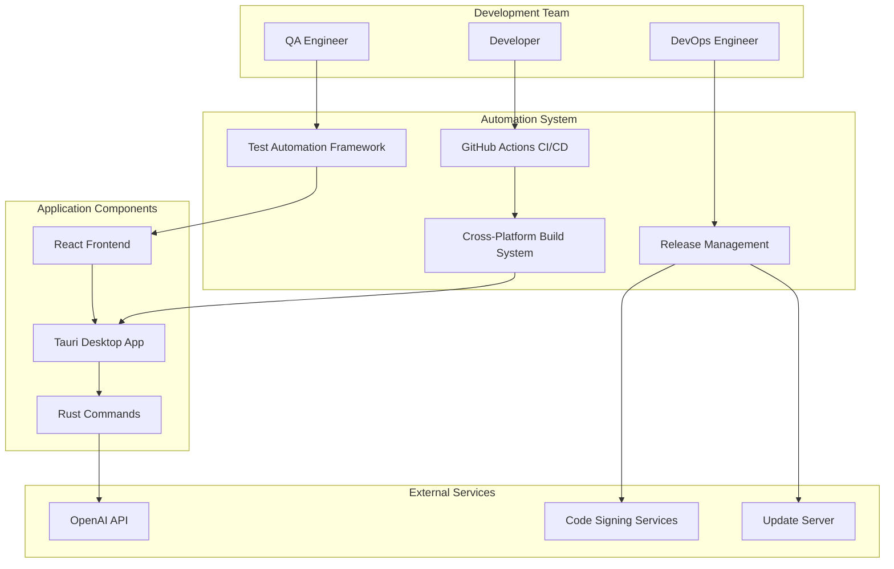
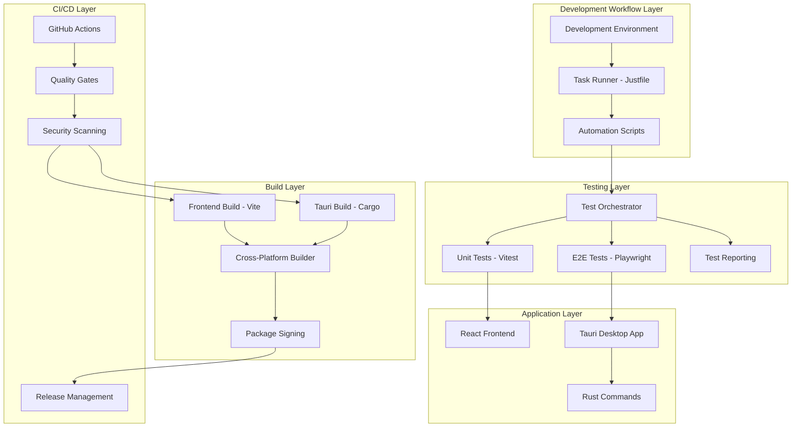
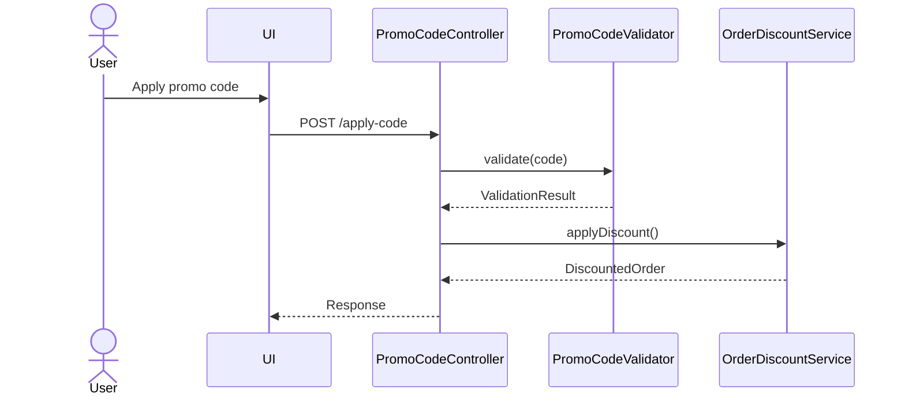

# Solution Design Document

## Validation Checklist
- [ ] Quality Goals prioritized (top 3-5 architectural quality attributes)
- [ ] Constraints documented (technical, organizational, security/compliance)
- [ ] Implementation Context complete (required sources, boundaries, external interfaces, project commands)
- [ ] Solution Strategy defined with rationale
- [ ] Building Block View complete (components, directory map, interface specifications)
- [ ] Runtime View documented (primary flow, error handling, complex logic)
- [ ] Deployment View specified (environment, configuration, dependencies, performance)
- [ ] Cross-Cutting Concepts addressed (patterns, interfaces, system-wide patterns, implementation patterns)
- [ ] Architecture Decisions captured with trade-offs
- [ ] **All Architecture Decisions confirmed by user** (no pending confirmations)
- [ ] Quality Requirements defined (performance, usability, security, reliability)
- [ ] Risks and Technical Debt identified (known issues, technical debt, implementation gotchas)
- [ ] Test Specifications complete (critical scenarios, coverage requirements)
- [ ] Glossary defined (domain and technical terms)
- [ ] No [NEEDS CLARIFICATION] markers remain

---

## Constraints

### Technical Constraints
- **Architecture**: Must work within existing Tauri 2.0 + React 18 + TypeScript + Python hybrid architecture
- **Platform Support**: Windows, macOS, and Linux with consistent behavior across all platforms
- **Performance**: CI/CD pipeline execution must complete within 15 minutes for full workflow
- **Testing**: Achieve 80%+ code coverage for React components, 95% for critical business logic
- **Build Times**: Cross-platform builds must complete within 30 minutes total across all platforms

### Organizational Constraints
- **Timeline**: 8-week implementation timeline from start to production deployment
- **Resources**: Single DevOps engineer with 25% development team support allocation
- **Team Skills**: Development team has basic automation familiarity but limited CI/CD expertise
- **Budget**: Code signing certificates ($300-600/platform) and potential CI/CD hosting costs
- **Change Management**: Must provide comprehensive training and gradual adoption

### Security/Compliance Constraints
- **Code Signing**: All platforms require digital signatures for distribution
- **Certificate Management**: Secure storage and rotation of signing certificates
- **API Security**: OpenAI API keys and credentials must be managed securely
- **File System**: Desktop app requires proper permissions and security validation
- **Data Protection**: User file analysis data must be protected according to privacy standards

## Implementation Context

**IMPORTANT**: Analysis of AI Disk Cleaner project structure and existing infrastructure

### Required Context Sources

#### General Context

```yaml
# Internal documentation and patterns
- doc: docs/specs/003-modern-web-ui/PRD.md
  relevance: HIGH
  why: "Desktop application requirements and user personas that constrain testing approach"

- doc: docs/specs/003-modern-web-ui/SDD.md
  relevance: HIGH
  why: "Existing Tauri + React architecture patterns and integration approaches"

- doc: web-ui/package.json
  relevance: HIGH
  why: "Current dependencies, scripts, and testing framework configuration"

- doc: web-ui/src-tauri/tauri.conf.json
  relevance: HIGH
  why: "Tauri configuration, permissions, and build settings that impact deployment"

# External documentation and APIs
- url: https://tauri.app/v1/guides/
  relevance: HIGH
  sections: [testing, building, security, distribution]
  why: "Tauri framework constraints and capabilities for automation"

- url: https://vitejs.dev/guide/
  relevance: MEDIUM
  sections: [testing, building, configuration]
  why: "Vite build system integration patterns"

- url: https://playwright.dev/
  relevance: MEDIUM
  sections: [test runners, cross-platform testing, CI integration]
  why: "E2E testing framework capabilities and best practices"
```

#### Component: Web UI (React + TypeScript)

```yaml
Location: web-ui/

# Source code files that must be understood
- file: web-ui/vitest.config.ts
  relevance: HIGH
  sections: [test configuration, coverage settings, test environment]
  why: "Existing unit testing setup that must be extended and integrated"

- file: web-ui/playwright.config.ts
  relevance: HIGH
  sections: [browser configuration, test patterns, reporting]
  why: "E2E testing foundation for desktop app workflows"

- file: web-ui/src/components/desktop-app.tsx
  relevance: MEDIUM
  why: "Main application component requiring comprehensive test coverage"

- file: web-ui/src/services/desktop-websocket.ts
  relevance: MEDIUM
  why: "WebSocket integration requiring connection testing and mocking"
```

#### Component: Tauri Backend (Rust)

```yaml
Location: web-ui/src-tauri/

# Source code files that must be understood
- file: src-tauri/Cargo.toml
  relevance: HIGH
  sections: [dependencies, features, build configuration]
  why: "Rust dependencies and build configuration for cross-platform compilation"

- file: src-tauri/src/main.rs
  relevance: HIGH
  sections: [application setup, Tauri commands, event handling]
  why: "Core Tauri application entry point requiring integration testing"

- file: src-tauri/src/commands.rs
  relevance: MEDIUM
  why: "Tauri commands for file system operations requiring security testing"
```

### Implementation Boundaries

#### Must Preserve
- **Tauri Application Architecture**: Existing Tauri 2.0 + React + TypeScript hybrid structure
- **Desktop UI Components**: Current desktop application components and user workflows
- **File System Security**: Existing security permissions and validation patterns
- **WebSocket Communication**: Current real-time communication patterns for desktop integration
- **OpenAI Integration**: Existing AI API integration and configuration management

#### Can Modify
- **Build Configuration**: Enhance Vite and Tauri build configurations for automation
- **Testing Setup**: Extend and integrate existing Vitest and Playwright configurations
- **Development Scripts**: Create comprehensive automation scripts and task runners
- **CI/CD Pipeline**: Implement GitHub Actions workflows for automated builds and deployment
- **Package Management**: Optimize dependency management and update processes

#### Must Not Touch
- **Core Application Logic**: Existing business logic for file analysis and AI features
- **User Data**: Any existing user data handling or storage patterns
- **Production Database**: Live production databases and user data
- **Security Certificates**: Production code signing certificates (use test certificates only)

### External Interfaces

#### System Context Diagram



#### Interface Specifications

```yaml
# Testing Framework Interfaces
testing_frameworks:
  - name: "Vitest Unit Testing"
    type: JavaScript/TypeScript
    doc: web-ui/vitest.config.ts
    integration: "Unit tests for React components and business logic"

  - name: "Playwright E2E Testing"
    type: Browser Automation
    doc: web-ui/playwright.config.ts
    integration: "End-to-end desktop application workflow testing"

  - name: "Python pytest"
    type: Python Testing
    integration: "Backend service testing and API validation"

# Build System Interfaces
build_systems:
  - name: "Vite Build System"
    type: JavaScript/TypeScript
    doc: web-ui/vite.config.ts
    integration: "Frontend build optimization and bundling"

  - name: "Tauri CLI"
    type: Rust/Tauri
    doc: web-ui/src-tauri/tauri.conf.json
    integration: "Cross-platform desktop application packaging"

  - name: "Cargo Build"
    type: Rust
    doc: web-ui/src-tauri/Cargo.toml
    integration: "Rust backend compilation and optimization"

# CI/CD Platform Interfaces
cicd_platforms:
  - name: "GitHub Actions"
    type: CI/CD Platform
    integration: "Automated testing, building, and deployment workflows"
    criticality: HIGH

  - name: "Code Signing Services"
    type: Security Service
    integration: "Digital signature application for all platform packages"
    criticality: HIGH

  - name: "Update Distribution"
    type: CDN/Static Hosting
    integration: "Application update manifest and package distribution"
    criticality: MEDIUM

# External Service Integrations
external_services:
  - name: "OpenAI API"
    type: AI Service
    doc: @docs/interfaces/openai-api.md
    integration: "AI-powered file analysis and recommendations"
    criticality: HIGH
    testing: "Mocked for automated testing, real for validation"
```

### Project Commands

```bash
# Component: Web UI (React + TypeScript + Tauri)
Location: web-ui/

## Environment Setup
Install Dependencies: npm install
Environment Variables: VITE_OPENAI_API_KEY, VITE_APP_VERSION
Start Development: npm run tauri:dev

# Current Testing Commands (from existing configuration)
Unit Tests: npm run test (Vitest)
E2E Tests: npm run test:e2e (Playwright)
Test Coverage: npm run test:coverage
Test Watch: npm run test:watch

# Current Build Commands
Build Project: npm run build
Build Tauri: npm run tauri:build
Development Server: npm run dev

# Current Quality Commands
Linting: npm run lint
Type Checking: npm run type-check
Formatting: npm run format (if configured)

# Automation Commands to be Added
Environment Setup: ./scripts/setup.sh
Development Coordination: ./scripts/dev.sh
Quality Assurance: ./scripts/test.sh
Cross-Platform Build: ./scripts/build-all.sh
Release Management: ./scripts/release.sh

# Component: Python Backend (if exists)
Location: [backend-directory/]

## Environment Setup
Install Dependencies: pip install -r requirements.txt
Environment Variables: PYTHONPATH, DATABASE_URL
Start Development: python main.py

# Testing Commands
Unit Tests: python -m pytest
Integration Tests: python -m pytest tests/integration/
Test Coverage: python -m pytest --cov
```

## Solution Strategy

### Architecture Pattern: Modular Automation Framework
- **Layered Approach**: Separate automation layers for testing, building, and deployment
- **Polyglot Coordination**: Unified orchestration across Python, TypeScript, and Rust components
- **Progressive Enhancement**: Start with essential automation, expand based on team needs
- **Developer-First Design**: Prioritize developer experience and workflow integration

### Integration Approach
- **Existing Tool Enhancement**: Extend current Vitest, Playwright, and npm script configurations
- **GitHub Actions Native**: Leverage GitHub's free tier for CI/CD with optional self-hosted runners
- **Cross-Platform Build Matrix**: Parallel builds for Windows, macOS, and Linux with dependency caching
- **Security Integration**: Automated code signing and vulnerability scanning within CI/CD pipeline

### Justification
This approach fits the constraints because:
- **Timeline Feasibility**: 8-week implementation is achievable with phased rollout
- **Resource Constraints**: Single DevOps engineer can manage with modular, well-documented system
- **Technical Compatibility**: Works within existing Tauri 2.0 + React architecture without major changes
- **Team Skills**: Builds on existing npm/Node.js knowledge while introducing automation gradually

### Key Decisions
1. **Task Runner Selection**: Justfile for cross-platform compatibility and shell integration
2. **CI/CD Platform**: GitHub Actions for native repository integration and generous free tier
3. **Testing Strategy**: Leverage existing Vitest/Playwright with enhanced orchestration
4. **Security Approach**: Certificate management through GitHub Actions encrypted secrets
5. **Deployment Model**: GitHub releases with automated package generation and distribution

## Building Block View

### Components



### Directory Map

**Component**: Automation Framework
```
.
├── scripts/ # NEW: Automation orchestration scripts
│   ├── setup.sh # NEW: One-command development environment setup
│   ├── dev.sh # NEW: Coordinated development server launcher
│   ├── test.sh # NEW: Unified test runner orchestration
│   ├── build.sh # NEW: Cross-platform build automation
│   ├── build-all.sh # NEW: Full cross-platform build matrix
│   ├── release.sh # NEW: Release management automation
│   └── cleanup.sh # NEW: Development environment maintenance
├── .github/ # NEW: CI/CD pipeline configuration
│   └── workflows/
│       ├── ci.yml # NEW: Continuous integration pipeline
│       ├── release.yml # NEW: Automated release pipeline
│       └── docs.yml # NEW: Documentation deployment
├── web-ui/ # MODIFIED: Enhanced build configuration
│   ├── justfile # NEW: Task runner configuration
│   ├── package.json # MODIFIED: Enhanced scripts and dependencies
│   ├── vitest.config.ts # MODIFIED: Enhanced testing configuration
│   ├── playwright.config.ts # MODIFIED: Enhanced E2E testing
│   └── src-tauri/
│       ├── tauri.conf.json # MODIFIED: Enhanced build configuration
│       └── Cargo.toml # MODIFIED: Enhanced dependencies
└── docs/ # NEW: Documentation and patterns
    ├── patterns/
    │   ├── testing-orchestration.md # NEW: Testing framework patterns
    │   ├── cross-platform-builds.md # NEW: Build automation patterns
    │   └── deployment-strategies.md # NEW: Deployment patterns
    └── interfaces/
        ├── testing-frameworks.md # NEW: Testing interface definitions
        └── ci-cd-integrations.md # NEW: CI/CD interface specifications
```

**Component**: Testing Infrastructure (within web-ui/)
```
web-ui/
├── tests/ # MODIFIED: Enhanced test structure
│   ├── unit/ # EXISTING: Enhanced with new coverage patterns
│   ├── integration/ # NEW: Integration test patterns
│   ├── e2e/ # EXISTING: Enhanced with desktop workflows
│   ├── fixtures/ # NEW: Test data and mocking utilities
│   └── helpers/ # NEW: Common test utilities and setup
├── vitest.config.ts # MODIFIED: Enhanced configuration
├── playwright.config.ts # MODIFIED: Enhanced configuration
└── package.json # MODIFIED: Enhanced test scripts
```

**Component**: Build System (within web-ui/)
```
web-ui/src-tauri/
├── build/ # NEW: Build utilities and helpers
│   ├── cross-platform.js # NEW: Cross-platform build orchestration
│   ├── signing.js # NEW: Code signing automation
│   └── packaging.js # NEW: Package generation utilities
├── tauri.conf.json # MODIFIED: Enhanced configuration
└── Cargo.toml # MODIFIED: Enhanced dependencies
```

### Interface Specifications

**Note**: Interfaces can be documented by referencing external documentation files OR specified inline. Choose the approach that best fits your project's documentation structure.

#### Interface Documentation References

[NEEDS CLARIFICATION: What interface documentation already exists that should be referenced?]
```yaml
# Reference existing interface documentation
interfaces:
  - name: "User Authentication API"
    doc: @docs/interfaces/auth-api.md
    relevance: CRITICAL
    sections: [authentication_flow, token_management]
    why: "Core authentication flow must be followed"
  
  - name: "Payment Processing Interface"
    doc: @docs/interfaces/payment-gateway.md
    relevance: HIGH
    sections: [transaction_processing, webhook_handling]
    why: "Integration with payment provider constraints"
    
  - name: "Event Bus Interface"
    doc: @docs/interfaces/event-bus.md (NEW)
    relevance: MEDIUM
    sections: [event_format, subscription_model]
    why: "New event-driven communication pattern"
```

#### Data Storage Changes

[NEEDS CLARIFICATION: Are database schema changes needed? If yes, specify tables, columns, and relationships. If no, remove this section]
```yaml
# Database/storage schema modifications
Table: primary_entity_table
  ADD COLUMN: new_field (data_type, constraints)
  MODIFY COLUMN: existing_field (new_constraints) 
  ADD INDEX: performance_index (fields)

Table: supporting_entity_table (NEW)
  id: primary_key
  related_id: foreign_key
  business_field: data_type, constraints
  
# Reference detailed schema documentation if available
schema_doc: @docs/interfaces/database-schema.md
migration_scripts: @migrations/v2.1.0/
```

#### Internal API Changes

[NEEDS CLARIFICATION: What API endpoints are being added or modified? Specify methods, paths, request/response formats]
```yaml
# Application endpoints being added/modified
Endpoint: Feature Operation
  Method: HTTP_METHOD
  Path: /api/version/resource/operation
  Request:
    required_field: data_type, validation_rules
    optional_field: data_type, default_value
  Response:
    success:
      result_field: data_type
      metadata: object_structure
    error:
      error_code: string
      message: string
      details: object (optional)
  
# Reference comprehensive API documentation if available
api_doc: @docs/interfaces/internal-api.md
openapi_spec: @specs/openapi.yaml
```

#### Application Data Models

[NEEDS CLARIFICATION: What data models/entities are being created or modified? Define fields and behaviors]
```pseudocode
# Core business objects being modified/created
ENTITY: PrimaryEntity (MODIFIED/NEW)
  FIELDS: 
    existing_field: data_type
    + new_field: data_type (NEW)
    ~ modified_field: updated_type (CHANGED)
  
  BEHAVIORS:
    existing_method(): return_type
    + new_method(parameters): return_type (NEW)
    ~ modified_method(): updated_return_type (CHANGED)

ENTITY: SupportingEntity (NEW)
  FIELDS: [field_definitions]
  BEHAVIORS: [method_definitions]
  
# Reference domain model documentation if available
domain_doc: @docs/domain/entity-model.md
```

#### Integration Points

[NEEDS CLARIFICATION: What external systems does this feature connect to? For multi-component features, also document inter-component communication.]
```yaml
# Inter-Component Communication (between your components)
From: [source-component]
To: [target-component]
  - protocol: [REST/GraphQL/gRPC/WebSocket/MessageQueue]
  - doc: @docs/interfaces/internal-api.md
  - endpoints: [specific endpoints or topics]
  - data_flow: "Description of what data flows between components"

# External System Integration (third-party services)
External_Service_Name:
  - doc: @docs/interfaces/service-name.md
  - sections: [relevant_endpoints, data_formats]
  - integration: "Brief description of how systems connect"
  - critical_data: [data_elements_exchanged]
```

### Implementation Examples

**Purpose**: Provide strategic code examples to clarify complex logic, critical algorithms, or integration patterns. These examples are for guidance, not prescriptive implementation.

**Include examples for**:
- Complex business logic that needs clarification
- Critical algorithms or calculations
- Non-obvious integration patterns
- Security-sensitive implementations
- Performance-critical sections

[NEEDS CLARIFICATION: Are there complex areas that would benefit from code examples? If not, remove this section]

#### Example: [Complex Business Logic Name]

**Why this example**: [Explain why this specific example helps clarify the implementation]

```typescript
// Example: Discount calculation with multiple rules
// This demonstrates the expected logic flow, not the exact implementation
function calculateDiscount(order: Order, user: User): Discount {
  // Business rule: VIP users get additional benefits
  const baseDiscount = order.subtotal * getBaseDiscountRate(user.tier);
  
  // Complex rule: Stacking discounts with limits
  const promotionalDiscount = Math.min(
    order.promotions.reduce((sum, promo) => sum + promo.value, 0),
    order.subtotal * MAX_PROMO_PERCENTAGE
  );
  
  // Edge case: Never exceed maximum discount
  return Math.min(
    baseDiscount + promotionalDiscount,
    order.subtotal * MAX_TOTAL_DISCOUNT
  );
}
```

#### Example: [Integration Pattern Name]

**Why this example**: [Explain why this pattern is important to document]

```python
# Example: Retry pattern for external service integration
# Shows expected error handling approach
async def call_payment_service(transaction):
    """
    Demonstrates resilient integration pattern.
    Actual implementation may use circuit breaker library.
    """
    for attempt in range(MAX_RETRIES):
        try:
            response = await payment_client.process(transaction)
            if response.requires_3ds:
                # Critical: Handle 3D Secure flow
                return await handle_3ds_flow(response)
            return response
        except TransientError as e:
            if attempt == MAX_RETRIES - 1:
                # Final attempt failed, escalate
                raise PaymentServiceUnavailable(e)
            await exponential_backoff(attempt)
        except PermanentError as e:
            # Don't retry permanent failures
            raise PaymentFailed(e)
```

#### Test Examples as Interface Documentation

[NEEDS CLARIFICATION: Can unit tests serve as interface documentation?]

```javascript
// Example: Unit test as interface contract
describe('PromoCodeValidator', () => {
  it('should validate promo code format and availability', async () => {
    // This test documents expected interface behavior
    const validator = new PromoCodeValidator(mockRepository);
    
    // Valid code passes all checks
    const validResult = await validator.validate('SUMMER2024');
    expect(validResult).toEqual({
      valid: true,
      discount: { type: 'percentage', value: 20 },
      restrictions: { minOrder: 50, maxUses: 1 }
    });
    
    // Expired code returns specific error
    const expiredResult = await validator.validate('EXPIRED2023');
    expect(expiredResult).toEqual({
      valid: false,
      error: 'PROMO_EXPIRED',
      message: 'This promotional code has expired'
    });
  });
});
```

## Runtime View

### Primary Flow

[NEEDS CLARIFICATION: What is the main user action and how does the system respond? Document the step-by-step flow]
#### Primary Flow: [Main User Action]
1. User triggers [action]
2. System validates [what]
3. Process executes [how]
4. Result displays [where]



### Error Handling
[NEEDS CLARIFICATION: How are different error types handled?]
- Invalid input: [specific error message and user guidance]
- Network failure: [retry strategy or fallback behavior]
- Business rule violation: [user feedback and recovery options]

### Complex Logic (if applicable)

[NEEDS CLARIFICATION: Is there complex algorithmic logic that needs documentation? If yes, detail the algorithm. If no, remove this section]
```
ALGORITHM: Process Feature Request
INPUT: user_request, current_state
OUTPUT: processed_result

1. VALIDATE: input_parameters, user_permissions, system_state
2. TRANSFORM: raw_input -> structured_data
3. APPLY_BUSINESS_RULES: 
   - Check constraints and limits
   - Calculate derived values
   - Apply conditional logic
4. INTEGRATE: update_external_systems, notify_stakeholders
5. PERSIST: save_changes, log_activities
6. RESPOND: return_result, update_user_interface
```

## Deployment View

[NEEDS CLARIFICATION: What are the deployment requirements and considerations? For multi-application features, consider coordination and dependencies. If there is no change to existing deployment, them remove sub-sections and just comment it as "no change"]

### Single Application Deployment
- **Environment**: [Where this runs - client/server/edge/cloud]
- **Configuration**: [Required env vars or settings]
- **Dependencies**: [External services or APIs needed]
- **Performance**: [Expected load, response time targets, caching strategy]

### Multi-Component Coordination (if applicable)

[NEEDS CLARIFICATION: How do multiple components coordinate during deployment?]
- **Deployment Order**: [Which components must deploy first?]
- **Version Dependencies**: [Minimum versions required between components]
- **Feature Flags**: [How to enable/disable features during rollout]
- **Rollback Strategy**: [How to handle partial deployment failures]
- **Data Migration Sequencing**: [Order of database changes across services]

## Cross-Cutting Concepts

### Pattern Documentation

[NEEDS CLARIFICATION: What existing patterns will be used and what new patterns need to be created?]
```yaml
# Existing patterns used in this feature
- pattern: @docs/patterns/[pattern-name].md
  relevance: [CRITICAL|HIGH|MEDIUM|LOW]
  why: "[Brief explanation of why this pattern is needed]"

# New patterns created for this feature  
- pattern: @docs/patterns/[new-pattern-name].md (NEW)
  relevance: [CRITICAL|HIGH|MEDIUM|LOW]
  why: "[Brief explanation of why this pattern was created]"
```

### Interface Specifications

[NEEDS CLARIFICATION: What external interfaces are involved and need documentation?]
```yaml
# External interfaces this feature integrates with
- interface: @docs/interfaces/[interface-name].md
  relevance: [CRITICAL|HIGH|MEDIUM|LOW]
  why: "[Brief explanation of why this interface is relevant]"

# New interfaces created
- interface: @docs/interfaces/[new-interface-name].md (NEW)
  relevance: [CRITICAL|HIGH|MEDIUM|LOW]
  why: "[Brief explanation of why this interface is being created]"
```

### System-Wide Patterns

[NEEDS CLARIFICATION: What system-wide patterns and concerns apply to this feature?]
- Security: [Authentication, authorization, encryption patterns]
- Error Handling: [Global vs local strategies, error propagation]
- Performance: [Caching strategies, batching, async patterns]
- i18n/L10n: [Multi-language support, localization approaches]
- Logging/Auditing: [Observability patterns, audit trail implementation]

### Multi-Component Patterns (if applicable)

[NEEDS CLARIFICATION: What patterns apply across multiple components?]
- **Communication Patterns**: [Sync vs async, event-driven, request-response]
- **Data Consistency**: [Eventual consistency, distributed transactions, saga patterns]
- **Shared Code**: [Shared libraries, monorepo packages, code generation]
- **Service Discovery**: [How components find each other in different environments]
- **Circuit Breakers**: [Handling failures between components]
- **Distributed Tracing**: [Correlation IDs, trace propagation across services]

### Implementation Patterns

#### Code Patterns and Conventions
[NEEDS CLARIFICATION: What code patterns, naming conventions, and implementation approaches should be followed?]

#### State Management Patterns
[NEEDS CLARIFICATION: How is state, refs, side effects, and data flow managed across the application?]

#### Performance Characteristics
[NEEDS CLARIFICATION: What are the system-wide performance strategies, optimization patterns, and resource management approaches?]

#### Integration Patterns
[NEEDS CLARIFICATION: What are the common approaches for external service integration, API communication, and event handling?]

#### Component Structure Pattern

[NEEDS CLARIFICATION: What component organization pattern should be followed?]
```pseudocode
# Follow existing component organization in codebase
COMPONENT: FeatureComponent(properties)
  INITIALIZE: local_state, external_data_hooks
  
  HANDLE: loading_states, error_states, success_states
  
  RENDER: 
    IF loading: loading_indicator
    IF error: error_display(error_info)
    IF success: main_content(data, actions)
```

#### Data Processing Pattern

[NEEDS CLARIFICATION: How should business logic flow be structured?]
```pseudocode
# Business logic flow
FUNCTION: process_feature_operation(input, context)
  VALIDATE: input_format, permissions, preconditions
  AUTHORIZE: user_access, operation_permissions
  TRANSFORM: input_data -> business_objects
  EXECUTE: core_business_logic
  PERSIST: save_results, update_related_data
  RESPOND: success_result OR error_information
```

#### Error Handling Pattern

[NEEDS CLARIFICATION: How should errors be classified, logged, and handled?]
```pseudocode
# Error management approach
FUNCTION: handle_operation_errors(operation_result)
  CLASSIFY: error_type (validation, business_rule, system)
  LOG: error_details, context_information
  RECOVER: attempt_recovery_if_applicable
  RESPOND: 
    user_facing_message(safe_error_info)
    system_recovery_action(if_needed)
```

#### Test Pattern

[NEEDS CLARIFICATION: What testing approach should be used for behavior verification?]
```pseudocode
# Testing approach for behavior verification
TEST_SCENARIO: "Feature operates correctly under normal conditions"
  SETUP: valid_input_data, required_system_state
  EXECUTE: feature_operation_with_input
  VERIFY: 
    expected_output_produced
    system_state_updated_correctly
    side_effects_occurred_as_expected
    error_conditions_handled_properly
```

### Integration Points

[NEEDS CLARIFICATION: How does this feature integrate with the existing system?]
- Connection Points: [Where this connects to existing system]
- Data Flow: [What data flows in/out]
- Events: [What events are triggered/consumed]

## Architecture Decisions

[NEEDS CLARIFICATION: What key architecture decisions need to be made? Each requires user confirmation.]

- [ ] **[Decision Name]**: [Choice made]
  - Rationale: [Why this over alternatives]
  - Trade-offs: [What we accept]
  - User confirmed: _Pending_

- [ ] **[Decision Name]**: [Choice made]
  - Rationale: [Why this over alternatives]
  - Trade-offs: [What we accept]
  - User confirmed: _Pending_

## Quality Requirements

[NEEDS CLARIFICATION: What are the specific, measurable quality requirements?]
- Performance: [Response time targets, throughput, resource limits]
- Usability: [User experience requirements, accessibility standards]
- Security: [Access control, data protection, audit requirements]
- Reliability: [Uptime targets, error recovery, data integrity]

## Risks and Technical Debt

### Known Technical Issues

[NEEDS CLARIFICATION: What current bugs, limitations, or issues affect this feature?]
- [Current bugs or limitations that affect the system]
- [Performance bottlenecks and their specific locations]
- [Memory leaks or resource management problems]
- [Integration issues with external systems]

### Technical Debt

[NEEDS CLARIFICATION: What technical debt exists that impacts this feature?]
- [Code duplication that needs refactoring]
- [Temporary workarounds that need proper solutions]
- [Anti-patterns that shouldn't be replicated]
- [Architectural violations or deviations]

### Implementation Gotchas

[NEEDS CLARIFICATION: What non-obvious issues might trip up implementation?]
- [Non-obvious dependencies or side effects]
- [Timing issues, race conditions, or synchronization problems]
- [Configuration quirks or environment-specific issues]
- [Known issues with third-party dependencies]

## Test Specifications

### Critical Test Scenarios

[NEEDS CLARIFICATION: What are the critical test scenarios that must pass?]
**Scenario 1: Primary Happy Path**
```gherkin
Given: [System in valid initial state]
And: [Required preconditions met]
When: [User performs main action]
Then: [Expected outcome occurs]
And: [System state updated correctly]
And: [Appropriate feedback provided]
```

**Scenario 2: Validation Error Handling**
```gherkin
Given: [System ready for input]
When: [User provides invalid input]
Then: [Specific error message displayed]
And: [System state remains unchanged]
And: [User can recover/retry]
```

**Scenario 3: System Error Recovery**
```gherkin
Given: [Normal operation in progress]
When: [System error occurs during processing]
Then: [Error handled gracefully]
And: [User notified appropriately]
And: [System maintains data integrity]
```

**Scenario 4: Edge Case Handling**
```gherkin
Given: [Boundary condition scenario]
When: [Edge case operation attempted]
Then: [System handles edge case correctly]
And: [No unexpected behavior occurs]
```

### Test Coverage Requirements

[NEEDS CLARIFICATION: What aspects require test coverage?]
- **Business Logic**: [All decision paths, calculations, validation rules]
- **User Interface**: [All interaction flows, states, accessibility]  
- **Integration Points**: [External service calls, data persistence]
- **Edge Cases**: [Boundary values, empty states, concurrent operations]
- **Performance**: [Response times under load, resource usage]
- **Security**: [Input validation, authorization, data protection]

## Glossary

[NEEDS CLARIFICATION: Define domain-specific and technical terms used throughout this document]

### Domain Terms

| Term | Definition | Context |
|------|------------|---------|
| [Domain Term] | [Clear, concise definition] | [Where/how it's used in this feature] |
| [Business Concept] | [Explanation in plain language] | [Relevance to the implementation] |

### Technical Terms

| Term | Definition | Context |
|------|------------|---------|
| [Technical Term] | [Technical definition] | [How it applies to this solution] |
| [Acronym/Abbreviation] | [Full form and explanation] | [Usage in the architecture] |

### API/Interface Terms

| Term | Definition | Context |
|------|------------|---------|
| [API Term] | [Specific meaning in this context] | [Related endpoints or operations] |
| [Protocol/Format] | [Technical specification] | [Where used in integrations] |
